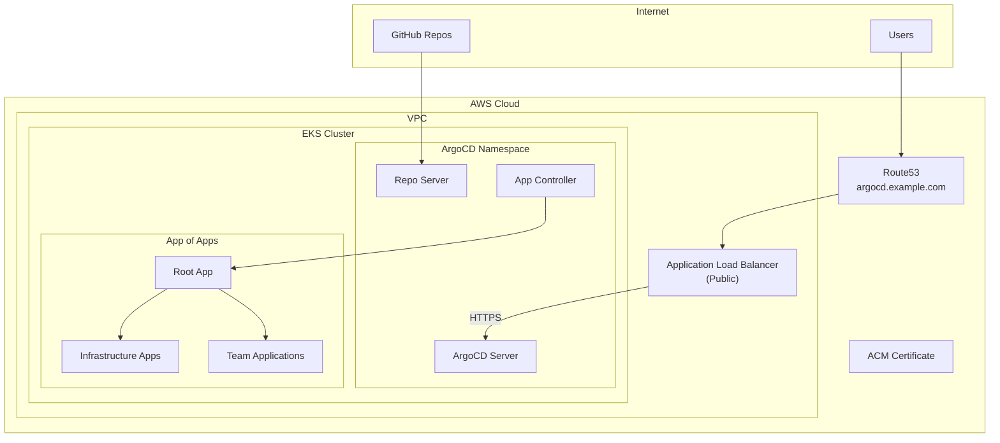

# ArgoCD on AWS EKS with ALB, HTTPS & App of Apps Pattern

This comprehensive guide covers deploying ArgoCD on AWS EKS with a public Application Load Balancer (ALB), HTTPS via Let's Encrypt/ACM, and implementing the App of Apps pattern for scalable GitOps.

## Prerequisites

- Running AWS EKS cluster (see [EKS deployment guide](/posts/aws-eks-terraform-github))
- AWS Load Balancer Controller installed
- Domain name with Route53 hosted zone
- `kubectl` and `helm` installed
- AWS CLI configured

## Architecture Overview



---

## Part 1: Install ArgoCD on EKS

### Step 1: Create ArgoCD Namespace and Install

```bash
# Create namespace
kubectl create namespace argocd

# Install ArgoCD using Helm (recommended for production)
helm repo add argo https://argoproj.github.io/argo-helm
helm repo update

# Install ArgoCD
helm install argocd argo/argo-cd \
    --namespace argocd \
    --set server.service.type=ClusterIP \
    --set server.ingress.enabled=false \
    --set configs.params.server.insecure=true \
    --set controller.replicas=2 \
    --set repoServer.replicas=2 \
    --set applicationSet.replicas=2 \
    --wait

# Wait for pods to be ready
kubectl wait --for=condition=Ready pods --all -n argocd --timeout=300s

# Get initial admin password
kubectl -n argocd get secret argocd-initial-admin-secret \
    -o jsonpath="{.data.password}" | base64 -d && echo
```

### Step 2: Create ACM Certificate (if not exists)

```bash
# Request ACM certificate for your domain
aws acm request-certificate \
    --domain-name argocd.example.com \
    --validation-method DNS \
    --region us-east-1

# Get certificate ARN
CERT_ARN=$(aws acm list-certificates --query "CertificateSummaryList[?DomainName=='argocd.example.com'].CertificateArn" --output text)
echo "Certificate ARN: $CERT_ARN"

# Add DNS validation record in Route53 (or validate via console)
```

### Step 3: Create ALB Ingress for ArgoCD

```bash
cat <<EOF | kubectl apply -f -
apiVersion: networking.k8s.io/v1
kind: Ingress
metadata:
  name: argocd-server-ingress
  namespace: argocd
  annotations:
    kubernetes.io/ingress.class: alb
    alb.ingress.kubernetes.io/scheme: internet-facing
    alb.ingress.kubernetes.io/target-type: ip
    alb.ingress.kubernetes.io/listen-ports: '[{"HTTP": 80}, {"HTTPS": 443}]'
    alb.ingress.kubernetes.io/ssl-redirect: '443'
    alb.ingress.kubernetes.io/certificate-arn: ${CERT_ARN}
    alb.ingress.kubernetes.io/backend-protocol: HTTP
    alb.ingress.kubernetes.io/healthcheck-path: /healthz
    alb.ingress.kubernetes.io/healthcheck-protocol: HTTP
    alb.ingress.kubernetes.io/success-codes: '200'
    alb.ingress.kubernetes.io/group.name: argocd
    alb.ingress.kubernetes.io/tags: Environment=production,Application=argocd
    alb.ingress.kubernetes.io/load-balancer-attributes: idle_timeout.timeout_seconds=600
    external-dns.alpha.kubernetes.io/hostname: argocd.example.com
spec:
  ingressClassName: alb
  rules:
  - host: argocd.example.com
    http:
      paths:
      - path: /
        pathType: Prefix
        backend:
          service:
            name: argocd-server
            port:
              number: 80
EOF
```

### Step 4: Configure DNS (Route53)

If using external-dns, it will automatically create the record. Otherwise:

```bash
# Get ALB DNS name
ALB_DNS=$(kubectl get ingress argocd-server-ingress -n argocd -o jsonpath='{.status.loadBalancer.ingress[0].hostname}')
echo "ALB DNS: $ALB_DNS"

# Get hosted zone ID
HOSTED_ZONE_ID=$(aws route53 list-hosted-zones-by-name --dns-name example.com --query "HostedZones[0].Id" --output text | cut -d'/' -f3)

# Create Route53 record
cat <<EOF > route53-record.json
{
  "Changes": [
    {
      "Action": "UPSERT",
      "ResourceRecordSet": {
        "Name": "argocd.example.com",
        "Type": "A",
        "AliasTarget": {
          "HostedZoneId": "Z35SXDOTRQ7X7K",
          "DNSName": "${ALB_DNS}",
          "EvaluateTargetHealth": true
        }
      }
    }
  ]
}
EOF

aws route53 change-resource-record-sets \
    --hosted-zone-id $HOSTED_ZONE_ID \
    --change-batch file://route53-record.json
```

### Step 5: Install External-DNS (Optional but Recommended)

```bash
cat <<EOF | kubectl apply -f -
apiVersion: v1
kind: ServiceAccount
metadata:
  name: external-dns
  namespace: kube-system
  annotations:
    eks.amazonaws.com/role-arn: arn:aws:iam::ACCOUNT_ID:role/external-dns-role
---
apiVersion: apps/v1
kind: Deployment
metadata:
  name: external-dns
  namespace: kube-system
spec:
  replicas: 1
  selector:
    matchLabels:
      app: external-dns
  template:
    metadata:
      labels:
        app: external-dns
    spec:
      serviceAccountName: external-dns
      containers:
      - name: external-dns
        image: registry.k8s.io/external-dns/external-dns:v0.14.0
        args:
        - --source=ingress
        - --source=service
        - --domain-filter=example.com
        - --provider=aws
        - --aws-zone-type=public
        - --registry=txt
        - --txt-owner-id=eks-cluster
EOF
```

---

## Part 2: Configure ArgoCD for HTTPS

### Step 6: Update ArgoCD ConfigMap

```bash
cat <<EOF | kubectl apply -f -
apiVersion: v1
kind: ConfigMap
metadata:
  name: argocd-cm
  namespace: argocd
data:
  url: https://argocd.example.com
  application.instanceLabelKey: argocd.argoproj.io/instance
  admin.enabled: "true"
  exec.enabled: "true"
  exec.shells: "bash,sh"
EOF

# Restart ArgoCD server to apply changes
kubectl rollout restart deployment argocd-server -n argocd
```

### Step 7: Configure RBAC

```bash
cat <<EOF | kubectl apply -f -
apiVersion: v1
kind: ConfigMap
metadata:
  name: argocd-rbac-cm
  namespace: argocd
data:
  policy.default: role:readonly
  policy.csv: |
    p, role:admin, applications, *, */*, allow
    p, role:admin, clusters, *, *, allow
    p, role:admin, repositories, *, *, allow
    p, role:admin, projects, *, *, allow
    p, role:admin, logs, get, */*, allow
    p, role:admin, exec, create, */*, allow
    
    p, role:developer, applications, get, */*, allow
    p, role:developer, applications, sync, */*, allow
    p, role:developer, logs, get, */*, allow
    
    g, admin, role:admin
EOF
```

---

## Part 3: GitHub Repository Setup for App of Apps

### Step 8: Repository Structure

Create your GitOps repository with this structure:

```
gitops-repo/
├── apps/                          # App of Apps definitions
│   ├── Chart.yaml                 # Helm chart for root app
│   ├── values.yaml                # Default values
│   ├── values-production.yaml     # Production overrides
│   └── templates/
│       ├── infrastructure/
│       │   ├── cert-manager.yaml
│       │   ├── external-dns.yaml
│       │   ├── prometheus.yaml
│       │   └── grafana.yaml
│       └── applications/
│           ├── team-a-apps.yaml
│           ├── team-b-apps.yaml
│           └── shared-services.yaml
├── infrastructure/                # Infrastructure charts
│   ├── cert-manager/
│   │   ├── Chart.yaml
│   │   └── values.yaml
│   ├── external-dns/
│   │   ├── Chart.yaml
│   │   └── values.yaml
│   ├── prometheus/
│   │   ├── Chart.yaml
│   │   └── values.yaml
│   └── grafana/
│       ├── Chart.yaml
│       └── values.yaml
├── applications/                  # Application configurations
│   ├── team-a/
│   │   ├── app1/
│   │   │   ├── base/
│   │   │   │   ├── kustomization.yaml
│   │   │   │   ├── deployment.yaml
│   │   │   │   └── service.yaml
│   │   │   └── overlays/
│   │   │       ├── staging/
│   │   │       │   └── kustomization.yaml
│   │   │       └── production/
│   │   │           └── kustomization.yaml
│   │   └── app2/
│   └── team-b/
│       └── app3/
└── projects/                      # ArgoCD Project definitions
    ├── infrastructure.yaml
    ├── team-a.yaml
    └── team-b.yaml
```

### Step 9: Create Root App of Apps Helm Chart

```yaml
# apps/Chart.yaml
apiVersion: v2
name: root-app
description: Root App of Apps for GitOps
type: application
version: 1.0.0
appVersion: "1.0.0"
```

```yaml
# apps/values.yaml
spec:
  project: default
  source:
    repoURL: https://github.com/your-org/gitops-repo.git
    targetRevision: HEAD
  destination:
    server: https://kubernetes.default.svc

applications:
  infrastructure:
    enabled: true
    apps:
      - name: cert-manager
        path: infrastructure/cert-manager
        namespace: cert-manager
      - name: external-dns
        path: infrastructure/external-dns
        namespace: kube-system
      - name: prometheus
        path: infrastructure/prometheus
        namespace: monitoring
      - name: grafana
        path: infrastructure/grafana
        namespace: monitoring

  teams:
    - name: team-a
      enabled: true
      apps:
        - name: app1
          path: applications/team-a/app1/overlays/production
          namespace: team-a
        - name: app2
          path: applications/team-a/app2/overlays/production
          namespace: team-a
    - name: team-b
      enabled: true
      apps:
        - name: app3
          path: applications/team-b/app3/overlays/production
          namespace: team-b
```

### Step 10: Create Infrastructure Application Templates

```yaml
# apps/templates/infrastructure/cert-manager.yaml
{{- if .Values.applications.infrastructure.enabled }}
{{- range .Values.applications.infrastructure.apps }}
{{- if eq .name "cert-manager" }}
apiVersion: argoproj.io/v1alpha1
kind: Application
metadata:
  name: {{ .name }}
  namespace: argocd
  finalizers:
    - resources-finalizer.argocd.argoproj.io
spec:
  project: infrastructure
  source:
    repoURL: {{ $.Values.spec.source.repoURL }}
    targetRevision: {{ $.Values.spec.source.targetRevision }}
    path: {{ .path }}
    helm:
      valueFiles:
        - values.yaml
  destination:
    server: {{ $.Values.spec.destination.server }}
    namespace: {{ .namespace }}
  syncPolicy:
    automated:
      prune: true
      selfHeal: true
    syncOptions:
      - CreateNamespace=true
      - ServerSideApply=true
    retry:
      limit: 5
      backoff:
        duration: 5s
        factor: 2
        maxDuration: 3m
{{- end }}
{{- end }}
{{- end }}
```

```yaml
# apps/templates/infrastructure/prometheus.yaml
{{- if .Values.applications.infrastructure.enabled }}
{{- range .Values.applications.infrastructure.apps }}
{{- if eq .name "prometheus" }}
apiVersion: argoproj.io/v1alpha1
kind: Application
metadata:
  name: {{ .name }}
  namespace: argocd
  finalizers:
    - resources-finalizer.argocd.argoproj.io
spec:
  project: infrastructure
  source:
    repoURL: {{ $.Values.spec.source.repoURL }}
    targetRevision: {{ $.Values.spec.source.targetRevision }}
    path: {{ .path }}
    helm:
      valueFiles:
        - values.yaml
  destination:
    server: {{ $.Values.spec.destination.server }}
    namespace: {{ .namespace }}
  syncPolicy:
    automated:
      prune: true
      selfHeal: true
    syncOptions:
      - CreateNamespace=true
    retry:
      limit: 5
      backoff:
        duration: 5s
        factor: 2
        maxDuration: 3m
{{- end }}
{{- end }}
{{- end }}
```

### Step 11: Create Team Application Templates

```yaml
# apps/templates/applications/team-apps.yaml
{{- range .Values.applications.teams }}
{{- if .enabled }}
{{- range .apps }}
apiVersion: argoproj.io/v1alpha1
kind: Application
metadata:
  name: {{ $.Release.Name }}-{{ .name }}
  namespace: argocd
  labels:
    team: {{ $.Release.Name }}
  finalizers:
    - resources-finalizer.argocd.argoproj.io
spec:
  project: {{ $.Release.Name }}
  source:
    repoURL: {{ $.Values.spec.source.repoURL }}
    targetRevision: {{ $.Values.spec.source.targetRevision }}
    path: {{ .path }}
    {{- if .helm }}
    helm:
      valueFiles:
        {{- range .helm.valueFiles }}
        - {{ . }}
        {{- end }}
    {{- end }}
  destination:
    server: {{ $.Values.spec.destination.server }}
    namespace: {{ .namespace }}
  syncPolicy:
    automated:
      prune: true
      selfHeal: true
    syncOptions:
      - CreateNamespace=true
    retry:
      limit: 5
      backoff:
        duration: 5s
        factor: 2
        maxDuration: 3m
---
{{- end }}
{{- end }}
{{- end }}
```

---

## Part 4: Kustomize Configuration

### Step 12: Base Kustomization Example

```yaml
# applications/team-a/app1/base/kustomization.yaml
apiVersion: kustomize.config.k8s.io/v1beta1
kind: Kustomization

resources:
  - deployment.yaml
  - service.yaml
  - ingress.yaml

commonLabels:
  app: app1
  team: team-a

images:
  - name: app1
    newName: your-registry/app1
    newTag: latest
```

```yaml
# applications/team-a/app1/base/deployment.yaml
apiVersion: apps/v1
kind: Deployment
metadata:
  name: app1
spec:
  replicas: 2
  selector:
    matchLabels:
      app: app1
  template:
    metadata:
      labels:
        app: app1
    spec:
      containers:
      - name: app1
        image: app1
        ports:
        - containerPort: 8080
        resources:
          requests:
            memory: "128Mi"
            cpu: "100m"
          limits:
            memory: "256Mi"
            cpu: "200m"
        livenessProbe:
          httpGet:
            path: /health
            port: 8080
          initialDelaySeconds: 30
          periodSeconds: 10
        readinessProbe:
          httpGet:
            path: /ready
            port: 8080
          initialDelaySeconds: 5
          periodSeconds: 5
```

```yaml
# applications/team-a/app1/base/service.yaml
apiVersion: v1
kind: Service
metadata:
  name: app1
spec:
  selector:
    app: app1
  ports:
  - port: 80
    targetPort: 8080
  type: ClusterIP
```

### Step 13: Production Overlay

```yaml
# applications/team-a/app1/overlays/production/kustomization.yaml
apiVersion: kustomize.config.k8s.io/v1beta1
kind: Kustomization

namespace: team-a-production

resources:
  - ../../base

commonLabels:
  environment: production

replicas:
  - name: app1
    count: 3

images:
  - name: app1
    newName: your-registry/app1
    newTag: v1.2.3

patches:
  - target:
      kind: Deployment
      name: app1
    patch: |-
      - op: replace
        path: /spec/template/spec/containers/0/resources/requests/memory
        value: "256Mi"
      - op: replace
        path: /spec/template/spec/containers/0/resources/limits/memory
        value: "512Mi"
```

### Step 14: Staging Overlay

```yaml
# applications/team-a/app1/overlays/staging/kustomization.yaml
apiVersion: kustomize.config.k8s.io/v1beta1
kind: Kustomization

namespace: team-a-staging

resources:
  - ../../base

commonLabels:
  environment: staging

replicas:
  - name: app1
    count: 1

images:
  - name: app1
    newName: your-registry/app1
    newTag: staging
```

---

## Part 5: ArgoCD Projects Configuration

### Step 15: Create ArgoCD Projects

```yaml
# projects/infrastructure.yaml
apiVersion: argoproj.io/v1alpha1
kind: AppProject
metadata:
  name: infrastructure
  namespace: argocd
spec:
  description: Infrastructure components
  sourceRepos:
    - 'https://github.com/your-org/gitops-repo.git'
    - 'https://charts.jetstack.io'
    - 'https://prometheus-community.github.io/helm-charts'
    - 'https://grafana.github.io/helm-charts'
  destinations:
    - namespace: '*'
      server: https://kubernetes.default.svc
  clusterResourceWhitelist:
    - group: '*'
      kind: '*'
  namespaceResourceWhitelist:
    - group: '*'
      kind: '*'
```

```yaml
# projects/team-a.yaml
apiVersion: argoproj.io/v1alpha1
kind: AppProject
metadata:
  name: team-a
  namespace: argocd
spec:
  description: Team A applications
  sourceRepos:
    - 'https://github.com/your-org/gitops-repo.git'
    - 'https://github.com/your-org/team-a-*'
  destinations:
    - namespace: 'team-a-*'
      server: https://kubernetes.default.svc
  clusterResourceWhitelist:
    - group: ''
      kind: Namespace
  namespaceResourceWhitelist:
    - group: '*'
      kind: '*'
  roles:
    - name: developer
      description: Team A developers
      policies:
        - p, proj:team-a:developer, applications, *, team-a/*, allow
        - p, proj:team-a:developer, logs, get, team-a/*, allow
        - p, proj:team-a:developer, exec, create, team-a/*, allow
      groups:
        - team-a-developers
```

```yaml
# projects/team-b.yaml
apiVersion: argoproj.io/v1alpha1
kind: AppProject
metadata:
  name: team-b
  namespace: argocd
spec:
  description: Team B applications
  sourceRepos:
    - 'https://github.com/your-org/gitops-repo.git'
    - 'https://github.com/your-org/team-b-*'
  destinations:
    - namespace: 'team-b-*'
      server: https://kubernetes.default.svc
  clusterResourceWhitelist:
    - group: ''
      kind: Namespace
  namespaceResourceWhitelist:
    - group: '*'
      kind: '*'
  roles:
    - name: developer
      description: Team B developers
      policies:
        - p, proj:team-b:developer, applications, *, team-b/*, allow
        - p, proj:team-b:developer, logs, get, team-b/*, allow
      groups:
        - team-b-developers
```

---

## Part 6: Deploy App of Apps

### Step 16: Apply ArgoCD Projects

```bash
# Apply projects first
kubectl apply -f projects/

# Verify projects
kubectl get appprojects -n argocd
```

### Step 17: Create Root Application

```bash
cat <<EOF | kubectl apply -f -
apiVersion: argoproj.io/v1alpha1
kind: Application
metadata:
  name: root-app
  namespace: argocd
  finalizers:
    - resources-finalizer.argocd.argoproj.io
spec:
  project: default
  source:
    repoURL: https://github.com/your-org/gitops-repo.git
    targetRevision: HEAD
    path: apps
    helm:
      valueFiles:
        - values.yaml
        - values-production.yaml
  destination:
    server: https://kubernetes.default.svc
    namespace: argocd
  syncPolicy:
    automated:
      prune: true
      selfHeal: true
    syncOptions:
      - CreateNamespace=true
    retry:
      limit: 5
      backoff:
        duration: 5s
        factor: 2
        maxDuration: 3m
EOF
```

### Step 18: Verify Deployment

```bash
# Check root application
argocd app get root-app

# List all applications
argocd app list

# Check specific child application
argocd app get cert-manager

# Sync specific application
argocd app sync root-app

# Watch application health
watch argocd app list
```

---

## Part 7: Infrastructure Helm Charts

### Step 19: Cert-Manager Chart

```yaml
# infrastructure/cert-manager/Chart.yaml
apiVersion: v2
name: cert-manager
description: Certificate management for Kubernetes
type: application
version: 1.0.0
appVersion: "v1.14.0"

dependencies:
  - name: cert-manager
    version: v1.14.0
    repository: https://charts.jetstack.io
```

```yaml
# infrastructure/cert-manager/values.yaml
cert-manager:
  installCRDs: true
  serviceAccount:
    annotations:
      eks.amazonaws.com/role-arn: arn:aws:iam::ACCOUNT_ID:role/cert-manager-role
  
  securityContext:
    runAsNonRoot: true
  
  prometheus:
    enabled: true
    servicemonitor:
      enabled: true

clusterIssuers:
  - name: letsencrypt-prod
    spec:
      acme:
        server: https://acme-v02.api.letsencrypt.org/directory
        email: admin@example.com
        privateKeySecretRef:
          name: letsencrypt-prod-key
        solvers:
          - dns01:
              route53:
                region: us-east-1
            selector:
              dnsZones:
                - example.com
```

### Step 20: Prometheus Stack Chart

```yaml
# infrastructure/prometheus/Chart.yaml
apiVersion: v2
name: prometheus-stack
description: Prometheus monitoring stack
type: application
version: 1.0.0
appVersion: "2.49.0"

dependencies:
  - name: kube-prometheus-stack
    version: "56.6.2"
    repository: https://prometheus-community.github.io/helm-charts
```

```yaml
# infrastructure/prometheus/values.yaml
kube-prometheus-stack:
  prometheus:
    prometheusSpec:
      retention: 15d
      storageSpec:
        volumeClaimTemplate:
          spec:
            storageClassName: gp3
            accessModes: ["ReadWriteOnce"]
            resources:
              requests:
                storage: 50Gi
      serviceMonitorSelectorNilUsesHelmValues: false
      podMonitorSelectorNilUsesHelmValues: false
  
  alertmanager:
    alertmanagerSpec:
      storage:
        volumeClaimTemplate:
          spec:
            storageClassName: gp3
            accessModes: ["ReadWriteOnce"]
            resources:
              requests:
                storage: 10Gi
  
  grafana:
    adminPassword: admin
    persistence:
      enabled: true
      storageClassName: gp3
      size: 10Gi
    ingress:
      enabled: true
      ingressClassName: alb
      annotations:
        alb.ingress.kubernetes.io/scheme: internet-facing
        alb.ingress.kubernetes.io/target-type: ip
        alb.ingress.kubernetes.io/listen-ports: '[{"HTTPS": 443}]'
        alb.ingress.kubernetes.io/certificate-arn: arn:aws:acm:us-east-1:ACCOUNT:certificate/xxx
      hosts:
        - grafana.example.com
```

---

## Part 8: ApplicationSet for Dynamic Apps

### Step 21: Create ApplicationSet for Git Generator

```yaml
# apps/templates/applicationsets/git-generator.yaml
apiVersion: argoproj.io/v1alpha1
kind: ApplicationSet
metadata:
  name: team-apps
  namespace: argocd
spec:
  generators:
    - git:
        repoURL: https://github.com/your-org/gitops-repo.git
        revision: HEAD
        directories:
          - path: applications/*/overlays/production
  template:
    metadata:
      name: '{{path[1]}}'
      namespace: argocd
    spec:
      project: '{{path[1]}}'
      source:
        repoURL: https://github.com/your-org/gitops-repo.git
        targetRevision: HEAD
        path: '{{path}}'
      destination:
        server: https://kubernetes.default.svc
        namespace: '{{path[1]}}-production'
      syncPolicy:
        automated:
          prune: true
          selfHeal: true
        syncOptions:
          - CreateNamespace=true
```

### Step 22: Create ApplicationSet for Multiple Clusters

```yaml
# apps/templates/applicationsets/multi-cluster.yaml
apiVersion: argoproj.io/v1alpha1
kind: ApplicationSet
metadata:
  name: multi-cluster-apps
  namespace: argocd
spec:
  generators:
    - matrix:
        generators:
          - git:
              repoURL: https://github.com/your-org/gitops-repo.git
              revision: HEAD
              directories:
                - path: applications/*/overlays/*
          - clusters:
              selector:
                matchLabels:
                  environment: production
  template:
    metadata:
      name: '{{name}}-{{path[1]}}-{{path[3]}}'
      namespace: argocd
    spec:
      project: default
      source:
        repoURL: https://github.com/your-org/gitops-repo.git
        targetRevision: HEAD
        path: '{{path}}'
      destination:
        server: '{{server}}'
        namespace: '{{path[1]}}-{{path[3]}}'
      syncPolicy:
        automated:
          prune: true
          selfHeal: true
        syncOptions:
          - CreateNamespace=true
```

---

## Part 9: CI/CD Integration

### Step 23: GitHub Actions for GitOps

```yaml
# .github/workflows/gitops.yml
name: GitOps Workflow

on:
  push:
    branches:
      - main
    paths:
      - 'applications/**'
      - 'infrastructure/**'
  pull_request:
    branches:
      - main

jobs:
  validate:
    name: Validate Manifests
    runs-on: ubuntu-latest
    steps:
      - uses: actions/checkout@v4

      - name: Setup Kustomize
        uses: imranismail/setup-kustomize@v2

      - name: Validate Kustomize overlays
        run: |
          for dir in applications/*/overlays/*; do
            echo "Validating $dir"
            kustomize build "$dir" > /dev/null
          done

      - name: Validate Helm charts
        run: |
          for chart in infrastructure/*/; do
            if [ -f "$chart/Chart.yaml" ]; then
              echo "Validating $chart"
              helm template "$chart" > /dev/null
            fi
          done

  sync:
    name: Trigger ArgoCD Sync
    runs-on: ubuntu-latest
    needs: validate
    if: github.ref == 'refs/heads/main'
    steps:
      - name: Trigger ArgoCD Sync
        run: |
          curl -X POST \
            -H "Authorization: Bearer ${{ secrets.ARGOCD_TOKEN }}" \
            https://argocd.example.com/api/v1/applications/root-app/sync
```

### Step 24: Image Updater Configuration

```yaml
# Install ArgoCD Image Updater
cat <<EOF | kubectl apply -f -
apiVersion: v1
kind: ConfigMap
metadata:
  name: argocd-image-updater-config
  namespace: argocd
data:
  registries.conf: |
    registries:
      - name: ECR
        api_url: https://ACCOUNT_ID.dkr.ecr.us-east-1.amazonaws.com
        prefix: ACCOUNT_ID.dkr.ecr.us-east-1.amazonaws.com
        credentials: ext:/scripts/ecr-login.sh
        default: true
EOF

# Annotate applications for auto-update
kubectl annotate application team-a-app1 -n argocd \
  argocd-image-updater.argoproj.io/image-list="app1=ACCOUNT_ID.dkr.ecr.us-east-1.amazonaws.com/app1" \
  argocd-image-updater.argoproj.io/app1.update-strategy=semver
```

---

## Summary

You now have:

1. **ArgoCD on EKS** with public ALB and HTTPS
2. **App of Apps pattern** with Helm and Kustomize
3. **Infrastructure apps** (cert-manager, prometheus, grafana)
4. **Team-specific projects** with RBAC isolation
5. **ApplicationSets** for dynamic application generation
6. **CI/CD integration** with GitHub Actions

### Quick Reference

```bash
# ArgoCD UI
https://argocd.example.com

# Login via CLI
argocd login argocd.example.com --grpc-web

# List all apps
argocd app list

# Sync root app (cascades to all child apps)
argocd app sync root-app

# Get app details
argocd app get <app-name>

# View app diff
argocd app diff <app-name>

# Rollback app
argocd app rollback <app-name> <revision>
```

### Repository Structure Reference

```
gitops-repo/
├── apps/                      # Root App of Apps
│   ├── Chart.yaml
│   ├── values.yaml
│   └── templates/
├── infrastructure/            # Infrastructure Helm charts
│   ├── cert-manager/
│   ├── external-dns/
│   ├── prometheus/
│   └── grafana/
├── applications/              # Team applications (Kustomize)
│   ├── team-a/
│   └── team-b/
├── projects/                  # ArgoCD Projects
└── .github/workflows/         # CI/CD workflows
```

### Next Steps

- Configure [SSO authentication](/posts/argocd-k3s-setup-sso-rbac)
- Set up [monitoring dashboards](/posts/prometheus-grafana-kubernetes-monitoring)
- Implement [GitOps best practices](/posts/argocd-gitops-kubernetes)
