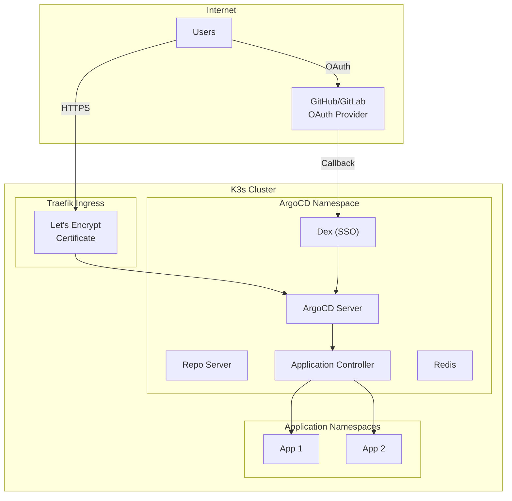

# ArgoCD on K3s: Complete Setup with SSO, RBAC, Terminal & Let's Encrypt

This comprehensive guide covers deploying ArgoCD on a K3s cluster with enterprise-grade features including SSO authentication, RBAC, pod terminal access, and secure public access with Let's Encrypt certificates.

## Prerequisites

- Running K3s cluster (see [K3s cluster setup guide](/posts/k3s-cluster-setup-etcd-dr-backup))
- `kubectl` configured with cluster access
- Domain name pointed to your cluster's public IP
- Git repository for GitOps configurations

## Architecture Overview



---

## Part 1: Install ArgoCD

### Step 1: Create Namespace and Install ArgoCD

```bash
# Create ArgoCD namespace
kubectl create namespace argocd

# Install ArgoCD (latest stable version - 2.10.x as of 2025)
kubectl apply -n argocd -f https://raw.githubusercontent.com/argoproj/argo-cd/stable/manifests/install.yaml

# Wait for all pods to be ready
kubectl wait --for=condition=Ready pods --all -n argocd --timeout=300s

# Verify installation
kubectl get pods -n argocd
```

### Step 2: Install ArgoCD CLI

```bash
# macOS
brew install argocd

# Linux (amd64)
curl -sSL -o argocd https://github.com/argoproj/argo-cd/releases/latest/download/argocd-linux-amd64
chmod +x argocd
sudo mv argocd /usr/local/bin/

# Windows (PowerShell)
# Download from: https://github.com/argoproj/argo-cd/releases/latest

# Verify installation
argocd version --client
```

### Step 3: Get Initial Admin Password

```bash
# Get the initial admin password
kubectl -n argocd get secret argocd-initial-admin-secret \
    -o jsonpath="{.data.password}" | base64 -d && echo

# Save this password for initial login
```

---

## Part 2: Expose ArgoCD with Let's Encrypt SSL

### Step 4: Install cert-manager

```bash
# Install cert-manager for automatic SSL certificate management
kubectl apply -f https://github.com/cert-manager/cert-manager/releases/download/v1.14.0/cert-manager.yaml

# Wait for cert-manager to be ready
kubectl wait --for=condition=Ready pods --all -n cert-manager --timeout=300s
```

### Step 5: Create ClusterIssuer for Let's Encrypt

```bash
cat <<EOF | kubectl apply -f -
apiVersion: cert-manager.io/v1
kind: ClusterIssuer
metadata:
  name: letsencrypt-prod
spec:
  acme:
    server: https://acme-v02.api.letsencrypt.org/directory
    email: admin@example.com  # Change to your email
    privateKeySecretRef:
      name: letsencrypt-prod-key
    solvers:
    - http01:
        ingress:
          class: traefik
---
apiVersion: cert-manager.io/v1
kind: ClusterIssuer
metadata:
  name: letsencrypt-staging
spec:
  acme:
    server: https://acme-staging-v02.api.letsencrypt.org/directory
    email: admin@example.com  # Change to your email
    privateKeySecretRef:
      name: letsencrypt-staging-key
    solvers:
    - http01:
        ingress:
          class: traefik
EOF
```

### Step 6: Configure ArgoCD Server for Insecure Mode (TLS at Ingress)

```bash
# Patch ArgoCD to disable TLS (Traefik will handle SSL)
kubectl patch configmap argocd-cmd-params-cm -n argocd \
    --type merge \
    -p '{"data":{"server.insecure":"true"}}'

# Restart ArgoCD server to apply changes
kubectl rollout restart deployment argocd-server -n argocd
kubectl rollout status deployment argocd-server -n argocd
```

### Step 7: Create Ingress with Let's Encrypt Certificate

```bash
cat <<EOF | kubectl apply -f -
apiVersion: networking.k8s.io/v1
kind: Ingress
metadata:
  name: argocd-server-ingress
  namespace: argocd
  annotations:
    cert-manager.io/cluster-issuer: letsencrypt-prod
    traefik.ingress.kubernetes.io/router.entrypoints: websecure
    traefik.ingress.kubernetes.io/router.tls: "true"
spec:
  ingressClassName: traefik
  tls:
  - hosts:
    - argocd.example.com  # Change to your domain
    secretName: argocd-server-tls
  rules:
  - host: argocd.example.com  # Change to your domain
    http:
      paths:
      - path: /
        pathType: Prefix
        backend:
          service:
            name: argocd-server
            port:
              number: 80
EOF

# Verify certificate is issued
kubectl get certificate -n argocd
kubectl describe certificate argocd-server-tls -n argocd
```

### Step 8: Create HTTP to HTTPS Redirect

```bash
cat <<EOF | kubectl apply -f -
apiVersion: traefik.io/v1alpha1
kind: Middleware
metadata:
  name: redirect-https
  namespace: argocd
spec:
  redirectScheme:
    scheme: https
    permanent: true
---
apiVersion: networking.k8s.io/v1
kind: Ingress
metadata:
  name: argocd-server-http
  namespace: argocd
  annotations:
    traefik.ingress.kubernetes.io/router.entrypoints: web
    traefik.ingress.kubernetes.io/router.middlewares: argocd-redirect-https@kubernetescrd
spec:
  ingressClassName: traefik
  rules:
  - host: argocd.example.com  # Change to your domain
    http:
      paths:
      - path: /
        pathType: Prefix
        backend:
          service:
            name: argocd-server
            port:
              number: 80
EOF
```

---

## Part 3: Configure SSO Authentication

ArgoCD uses Dex for SSO integration. We'll configure GitHub OAuth as an example.

### Step 9: Create GitHub OAuth Application

1. Go to **GitHub** → **Settings** → **Developer settings** → **OAuth Apps**
2. Click **New OAuth App**
3. Fill in the details:
   - **Application name**: ArgoCD
   - **Homepage URL**: `https://argocd.example.com`
   - **Authorization callback URL**: `https://argocd.example.com/api/dex/callback`
4. Save the **Client ID** and generate a **Client Secret**

### Step 10: Configure Dex for GitHub SSO

```bash
# Create secret with GitHub OAuth credentials
kubectl create secret generic github-oauth-secret \
    -n argocd \
    --from-literal=client-id=YOUR_GITHUB_CLIENT_ID \
    --from-literal=client-secret=YOUR_GITHUB_CLIENT_SECRET

# Update ArgoCD ConfigMap with Dex configuration
cat <<EOF | kubectl apply -f -
apiVersion: v1
kind: ConfigMap
metadata:
  name: argocd-cm
  namespace: argocd
data:
  url: https://argocd.example.com
  dex.config: |
    connectors:
      - type: github
        id: github
        name: GitHub
        config:
          clientID: \$github-oauth-secret:client-id
          clientSecret: \$github-oauth-secret:client-secret
          orgs:
            - name: your-github-org  # Optional: restrict to org members
          loadAllGroups: true
          teamNameField: slug
          useLoginAsID: false
EOF

# Restart Dex to apply changes
kubectl rollout restart deployment argocd-dex-server -n argocd
```

### Step 11: Alternative - Configure OIDC (Okta/Azure AD/Google)

For Okta:

```bash
cat <<EOF | kubectl apply -f -
apiVersion: v1
kind: ConfigMap
metadata:
  name: argocd-cm
  namespace: argocd
data:
  url: https://argocd.example.com
  oidc.config: |
    name: Okta
    issuer: https://your-org.okta.com
    clientID: YOUR_OKTA_CLIENT_ID
    clientSecret: \$okta-secret:clientSecret
    requestedScopes: ["openid", "profile", "email", "groups"]
    requestedIDTokenClaims:
      groups:
        essential: true
EOF
```

For Azure AD:

```bash
cat <<EOF | kubectl apply -f -
apiVersion: v1
kind: ConfigMap
metadata:
  name: argocd-cm
  namespace: argocd
data:
  url: https://argocd.example.com
  oidc.config: |
    name: Azure AD
    issuer: https://login.microsoftonline.com/YOUR_TENANT_ID/v2.0
    clientID: YOUR_AZURE_CLIENT_ID
    clientSecret: \$azure-secret:clientSecret
    requestedScopes: ["openid", "profile", "email"]
    requestedIDTokenClaims:
      groups:
        essential: true
EOF
```

### Step 12: Disable Admin Account (After SSO is Working)

```bash
# Once SSO is confirmed working, disable the admin account
kubectl patch configmap argocd-cm -n argocd \
    --type merge \
    -p '{"data":{"admin.enabled":"false"}}'

kubectl rollout restart deployment argocd-server -n argocd
```

---

## Part 4: Configure RBAC

### Step 13: Understanding ArgoCD RBAC

ArgoCD RBAC uses a policy format:
```
p, <subject>, <resource>, <action>, <object>, <effect>
g, <user/group>, <role>
```

**Resources**: `applications`, `clusters`, `repositories`, `logs`, `exec`, `projects`
**Actions**: `get`, `create`, `update`, `delete`, `sync`, `override`, `action/*`

### Step 14: Configure RBAC Policies

```bash
cat <<EOF | kubectl apply -f -
apiVersion: v1
kind: ConfigMap
metadata:
  name: argocd-rbac-cm
  namespace: argocd
data:
  policy.default: role:readonly
  scopes: '[groups, email]'
  policy.csv: |
    # Admin role - full access
    p, role:admin, applications, *, */*, allow
    p, role:admin, clusters, *, *, allow
    p, role:admin, repositories, *, *, allow
    p, role:admin, projects, *, *, allow
    p, role:admin, accounts, *, *, allow
    p, role:admin, gpgkeys, *, *, allow
    p, role:admin, logs, get, */*, allow
    p, role:admin, exec, create, */*, allow
    
    # Developer role - can sync apps but not modify cluster settings
    p, role:developer, applications, get, */*, allow
    p, role:developer, applications, sync, */*, allow
    p, role:developer, applications, action/*, */*, allow
    p, role:developer, logs, get, */*, allow
    p, role:developer, exec, create, */*, allow
    p, role:developer, repositories, get, *, allow
    p, role:developer, projects, get, *, allow
    
    # Viewer role - read-only access
    p, role:viewer, applications, get, */*, allow
    p, role:viewer, repositories, get, *, allow
    p, role:viewer, projects, get, *, allow
    p, role:viewer, logs, get, */*, allow
    
    # Team-specific roles (by project)
    p, role:team-a, applications, *, team-a/*, allow
    p, role:team-a, logs, get, team-a/*, allow
    p, role:team-a, exec, create, team-a/*, allow
    
    p, role:team-b, applications, *, team-b/*, allow
    p, role:team-b, logs, get, team-b/*, allow
    p, role:team-b, exec, create, team-b/*, allow
    
    # Map GitHub teams/groups to roles
    g, your-github-org:admins, role:admin
    g, your-github-org:developers, role:developer
    g, your-github-org:team-a, role:team-a
    g, your-github-org:team-b, role:team-b
    
    # Map individual users (fallback)
    g, admin@example.com, role:admin
EOF

# Restart ArgoCD server to apply RBAC changes
kubectl rollout restart deployment argocd-server -n argocd
```

### Step 15: Create ArgoCD Projects for Team Isolation

```bash
cat <<EOF | kubectl apply -f -
apiVersion: argoproj.io/v1alpha1
kind: AppProject
metadata:
  name: team-a
  namespace: argocd
spec:
  description: Team A's applications
  sourceRepos:
    - 'https://github.com/your-org/team-a-*'
    - 'https://github.com/your-org/shared-charts'
  destinations:
    - namespace: 'team-a-*'
      server: https://kubernetes.default.svc
    - namespace: 'team-a-*'
      server: '*'
  clusterResourceWhitelist:
    - group: ''
      kind: Namespace
  namespaceResourceWhitelist:
    - group: '*'
      kind: '*'
  roles:
    - name: developer
      description: Team A developers
      policies:
        - p, proj:team-a:developer, applications, *, team-a/*, allow
      groups:
        - your-github-org:team-a
---
apiVersion: argoproj.io/v1alpha1
kind: AppProject
metadata:
  name: team-b
  namespace: argocd
spec:
  description: Team B's applications
  sourceRepos:
    - 'https://github.com/your-org/team-b-*'
    - 'https://github.com/your-org/shared-charts'
  destinations:
    - namespace: 'team-b-*'
      server: https://kubernetes.default.svc
  clusterResourceWhitelist:
    - group: ''
      kind: Namespace
  namespaceResourceWhitelist:
    - group: '*'
      kind: '*'
  roles:
    - name: developer
      description: Team B developers
      policies:
        - p, proj:team-b:developer, applications, *, team-b/*, allow
      groups:
        - your-github-org:team-b
EOF
```

---

## Part 5: Enable Terminal Tab for Pod Shell Access

### Step 16: Enable Web Terminal Feature

ArgoCD supports a web-based terminal for pod shell access. This requires enabling the `exec` feature.

```bash
# Update ArgoCD ConfigMap to enable exec
cat <<EOF | kubectl apply -f -
apiVersion: v1
kind: ConfigMap
metadata:
  name: argocd-cm
  namespace: argocd
data:
  # ... existing configuration ...
  exec.enabled: "true"
  exec.shells: "bash,sh,powershell,cmd"
EOF

# Restart ArgoCD server
kubectl rollout restart deployment argocd-server -n argocd
```

### Step 17: Grant Exec Permissions in RBAC

```bash
# The RBAC policy needs exec permissions (already included in Step 14)
# Verify exec permissions are in place:
kubectl get configmap argocd-rbac-cm -n argocd -o yaml | grep exec

# Should show lines like:
# p, role:admin, exec, create, */*, allow
# p, role:developer, exec, create, */*, allow
```

### Step 18: Configure Pod Terminal Settings

```bash
cat <<EOF | kubectl apply -f -
apiVersion: v1
kind: ConfigMap
metadata:
  name: argocd-cmd-params-cm
  namespace: argocd
data:
  server.insecure: "true"
  # Terminal settings
  server.exec.shell: "/bin/bash"
EOF

kubectl rollout restart deployment argocd-server -n argocd
```

### Step 19: Using the Terminal

1. Navigate to an application in ArgoCD UI
2. Click on a running pod
3. Select the **Terminal** tab
4. Choose a container (if multiple)
5. Select shell type (bash/sh)
6. Click **Connect**

**CLI Alternative:**

```bash
# Using ArgoCD CLI for terminal access
argocd app exec my-app --namespace my-namespace --pod my-pod-xyz -- /bin/bash
```

---

## Part 6: Security Best Practices

### Step 20: Configure Security Headers

```bash
cat <<EOF | kubectl apply -f -
apiVersion: traefik.io/v1alpha1
kind: Middleware
metadata:
  name: security-headers
  namespace: argocd
spec:
  headers:
    customRequestHeaders:
      X-Forwarded-Proto: https
    customResponseHeaders:
      X-Frame-Options: DENY
      X-Content-Type-Options: nosniff
      X-XSS-Protection: "1; mode=block"
      Strict-Transport-Security: "max-age=31536000; includeSubDomains"
      Content-Security-Policy: "default-src 'self'; script-src 'self' 'unsafe-inline' 'unsafe-eval'; style-src 'self' 'unsafe-inline'"
EOF

# Update ingress to use security headers
kubectl patch ingress argocd-server-ingress -n argocd \
    --type merge \
    -p '{"metadata":{"annotations":{"traefik.ingress.kubernetes.io/router.middlewares":"argocd-security-headers@kubernetescrd"}}}'
```

### Step 21: Enable Audit Logging

```bash
# Check ArgoCD server logs for audit events
kubectl logs -n argocd deployment/argocd-server | grep -i audit

# Configure structured logging
kubectl patch configmap argocd-cmd-params-cm -n argocd \
    --type merge \
    -p '{"data":{"server.log.format":"json","server.log.level":"info"}}'
```

### Step 22: Network Policies

```bash
cat <<EOF | kubectl apply -f -
apiVersion: networking.k8s.io/v1
kind: NetworkPolicy
metadata:
  name: argocd-server-policy
  namespace: argocd
spec:
  podSelector:
    matchLabels:
      app.kubernetes.io/name: argocd-server
  policyTypes:
    - Ingress
    - Egress
  ingress:
    - from:
        - namespaceSelector:
            matchLabels:
              name: kube-system
        - namespaceSelector:
            matchLabels:
              name: argocd
    - ports:
        - protocol: TCP
          port: 8080
        - protocol: TCP
          port: 8083
  egress:
    - to:
        - namespaceSelector: {}
    - ports:
        - protocol: TCP
          port: 443
        - protocol: TCP
          port: 22
EOF
```

---

## Part 7: Verification and Testing

### Step 23: Verify Installation

```bash
# Check all ArgoCD components
kubectl get pods -n argocd
kubectl get svc -n argocd
kubectl get ingress -n argocd

# Check certificate status
kubectl get certificate -n argocd
kubectl describe certificate argocd-server-tls -n argocd

# Test HTTPS access
curl -v https://argocd.example.com/api/version

# Login via CLI
argocd login argocd.example.com --username admin --password <password>

# Check SSO configuration
argocd account list
```

### Step 24: Test SSO Login

1. Open `https://argocd.example.com` in browser
2. Click **Log in via GitHub** (or your SSO provider)
3. Authenticate with your SSO provider
4. Verify you're logged in with correct permissions

### Step 25: Test Terminal Access

```bash
# Create a test application
argocd app create test-app \
    --repo https://github.com/argoproj/argocd-example-apps.git \
    --path guestbook \
    --dest-server https://kubernetes.default.svc \
    --dest-namespace default

# Sync the application
argocd app sync test-app

# Test terminal access via CLI
argocd app exec test-app -- /bin/sh -c "hostname"
```

---

## Part 8: Monitoring and Maintenance

### Step 26: Set Up Monitoring

```bash
# ArgoCD exposes metrics on port 8083
cat <<EOF | kubectl apply -f -
apiVersion: monitoring.coreos.com/v1
kind: ServiceMonitor
metadata:
  name: argocd-metrics
  namespace: argocd
  labels:
    release: prometheus
spec:
  selector:
    matchLabels:
      app.kubernetes.io/name: argocd-server
  endpoints:
    - port: metrics
      interval: 30s
---
apiVersion: monitoring.coreos.com/v1
kind: ServiceMonitor
metadata:
  name: argocd-repo-server-metrics
  namespace: argocd
  labels:
    release: prometheus
spec:
  selector:
    matchLabels:
      app.kubernetes.io/name: argocd-repo-server
  endpoints:
    - port: metrics
      interval: 30s
EOF
```

### Step 27: Backup ArgoCD Configuration

```bash
# Backup all ArgoCD applications
kubectl get applications -n argocd -o yaml > argocd-applications-backup.yaml

# Backup all AppProjects
kubectl get appprojects -n argocd -o yaml > argocd-projects-backup.yaml

# Backup ConfigMaps and Secrets
kubectl get configmap -n argocd -o yaml > argocd-configmaps-backup.yaml
kubectl get secret -n argocd -o yaml > argocd-secrets-backup.yaml

# Or use argocd CLI for app export
argocd app list -o yaml > argocd-apps-export.yaml
```

---

## Summary

You now have ArgoCD deployed on K3s with:

1. **Let's Encrypt SSL** - Automatic HTTPS with certificate renewal
2. **SSO Authentication** - GitHub/Okta/Azure AD integration
3. **RBAC Configuration** - Role-based access control with team isolation
4. **Terminal Access** - Web-based shell access to pods
5. **Security Hardening** - Headers, network policies, audit logging

### Quick Reference

```bash
# ArgoCD UI
https://argocd.example.com

# Login via CLI
argocd login argocd.example.com --sso

# Check apps
argocd app list

# Sync an app
argocd app sync <app-name>

# Terminal access
argocd app exec <app-name> -- /bin/bash

# Check logs
kubectl logs -n argocd -l app.kubernetes.io/name=argocd-server
```

### Next Steps

- Deploy [AWS EKS cluster with Terraform](/posts/aws-eks-terraform-github)
- Set up [App of Apps pattern](/posts/argocd-eks-alb-app-of-apps)
- Configure [Prometheus monitoring](/posts/prometheus-grafana-kubernetes-monitoring)
