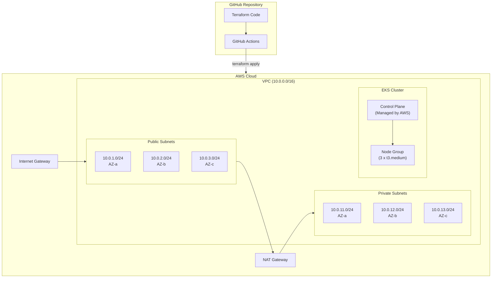

# Deploy AWS EKS Cluster with Terraform from GitHub

This guide walks you through deploying a production-ready 3-node AWS EKS cluster using Terraform, with the infrastructure code stored in GitHub and automated deployment via GitHub Actions.

## Prerequisites

- AWS Account with appropriate permissions
- GitHub account
- AWS CLI installed locally
- Terraform 1.6+ installed locally
- kubectl installed locally

## Architecture Overview



---

## Part 1: GitHub Repository Setup

### Step 1: Create GitHub Repository

```bash
# Create a new directory for your Terraform code
mkdir eks-terraform-infrastructure
cd eks-terraform-infrastructure

# Initialize git repository
git init

# Create directory structure
mkdir -p modules/{vpc,eks,iam}
mkdir -p environments/{dev,staging,prod}
mkdir -p .github/workflows

# Create initial files
touch main.tf variables.tf outputs.tf versions.tf terraform.tfvars
touch .gitignore README.md
```

### Step 2: Configure .gitignore

```bash
cat > .gitignore << 'EOF'
# Terraform
*.tfstate
*.tfstate.*
.terraform/
.terraform.lock.hcl
*.tfvars
!example.tfvars

# IDE
.idea/
.vscode/
*.swp
*.swo

# OS
.DS_Store
Thumbs.db

# Secrets
*.pem
*.key
secrets/
EOF
```

---

## Part 2: Terraform Configuration

### Step 3: Configure Terraform Versions (versions.tf)

```hcl
# versions.tf
terraform {
  required_version = ">= 1.6.0"

  required_providers {
    aws = {
      source  = "hashicorp/aws"
      version = "~> 5.31"
    }
    kubernetes = {
      source  = "hashicorp/kubernetes"
      version = "~> 2.25"
    }
    helm = {
      source  = "hashicorp/helm"
      version = "~> 2.12"
    }
    tls = {
      source  = "hashicorp/tls"
      version = "~> 4.0"
    }
  }

  backend "s3" {
    bucket         = "your-terraform-state-bucket"
    key            = "eks/terraform.tfstate"
    region         = "us-east-1"
    encrypt        = true
    dynamodb_table = "terraform-state-lock"
  }
}
```

### Step 4: Create Variables (variables.tf)

```hcl
# variables.tf
variable "aws_region" {
  description = "AWS region for resources"
  type        = string
  default     = "us-east-1"
}

variable "environment" {
  description = "Environment name"
  type        = string
  default     = "production"
}

variable "project_name" {
  description = "Project name for resource naming"
  type        = string
  default     = "myapp"
}

variable "cluster_name" {
  description = "EKS cluster name"
  type        = string
  default     = "eks-production"
}

variable "cluster_version" {
  description = "Kubernetes version"
  type        = string
  default     = "1.29"
}

variable "vpc_cidr" {
  description = "VPC CIDR block"
  type        = string
  default     = "10.0.0.0/16"
}

variable "availability_zones" {
  description = "List of availability zones"
  type        = list(string)
  default     = ["us-east-1a", "us-east-1b", "us-east-1c"]
}

variable "private_subnet_cidrs" {
  description = "Private subnet CIDR blocks"
  type        = list(string)
  default     = ["10.0.11.0/24", "10.0.12.0/24", "10.0.13.0/24"]
}

variable "public_subnet_cidrs" {
  description = "Public subnet CIDR blocks"
  type        = list(string)
  default     = ["10.0.1.0/24", "10.0.2.0/24", "10.0.3.0/24"]
}

variable "node_instance_types" {
  description = "EC2 instance types for worker nodes"
  type        = list(string)
  default     = ["t3.medium"]
}

variable "node_desired_size" {
  description = "Desired number of worker nodes"
  type        = number
  default     = 3
}

variable "node_min_size" {
  description = "Minimum number of worker nodes"
  type        = number
  default     = 2
}

variable "node_max_size" {
  description = "Maximum number of worker nodes"
  type        = number
  default     = 5
}

variable "node_disk_size" {
  description = "Disk size for worker nodes (GB)"
  type        = number
  default     = 50
}

variable "enable_cluster_autoscaler" {
  description = "Enable cluster autoscaler"
  type        = bool
  default     = true
}

variable "tags" {
  description = "Common tags for all resources"
  type        = map(string)
  default     = {}
}
```

### Step 5: Create Main Configuration (main.tf)

```hcl
# main.tf
provider "aws" {
  region = var.aws_region

  default_tags {
    tags = merge(var.tags, {
      Environment = var.environment
      Project     = var.project_name
      ManagedBy   = "Terraform"
    })
  }
}

data "aws_caller_identity" "current" {}
data "aws_availability_zones" "available" {}

locals {
  cluster_name = "${var.project_name}-${var.environment}-eks"
  
  common_tags = {
    "kubernetes.io/cluster/${local.cluster_name}" = "owned"
  }
}

#---------------------------------------------------------------
# VPC Configuration
#---------------------------------------------------------------
module "vpc" {
  source  = "terraform-aws-modules/vpc/aws"
  version = "~> 5.4"

  name = "${var.project_name}-${var.environment}-vpc"
  cidr = var.vpc_cidr

  azs             = var.availability_zones
  private_subnets = var.private_subnet_cidrs
  public_subnets  = var.public_subnet_cidrs

  enable_nat_gateway     = true
  single_nat_gateway     = false
  one_nat_gateway_per_az = true
  enable_dns_hostnames   = true
  enable_dns_support     = true

  public_subnet_tags = {
    "kubernetes.io/role/elb"                      = 1
    "kubernetes.io/cluster/${local.cluster_name}" = "owned"
  }

  private_subnet_tags = {
    "kubernetes.io/role/internal-elb"             = 1
    "kubernetes.io/cluster/${local.cluster_name}" = "owned"
  }

  tags = local.common_tags
}

#---------------------------------------------------------------
# EKS Cluster
#---------------------------------------------------------------
module "eks" {
  source  = "terraform-aws-modules/eks/aws"
  version = "~> 20.2"

  cluster_name    = local.cluster_name
  cluster_version = var.cluster_version

  cluster_endpoint_public_access  = true
  cluster_endpoint_private_access = true

  vpc_id     = module.vpc.vpc_id
  subnet_ids = module.vpc.private_subnets

  enable_irsa = true

  cluster_addons = {
    coredns = {
      most_recent = true
    }
    kube-proxy = {
      most_recent = true
    }
    vpc-cni = {
      most_recent              = true
      before_compute           = true
      service_account_role_arn = module.vpc_cni_irsa.iam_role_arn
      configuration_values = jsonencode({
        env = {
          ENABLE_PREFIX_DELEGATION = "true"
          WARM_PREFIX_TARGET       = "1"
        }
      })
    }
    aws-ebs-csi-driver = {
      most_recent              = true
      service_account_role_arn = module.ebs_csi_irsa.iam_role_arn
    }
  }

  eks_managed_node_groups = {
    main = {
      name            = "${local.cluster_name}-node-group"
      use_name_prefix = true

      instance_types = var.node_instance_types
      capacity_type  = "ON_DEMAND"

      min_size     = var.node_min_size
      max_size     = var.node_max_size
      desired_size = var.node_desired_size

      disk_size = var.node_disk_size

      labels = {
        Environment = var.environment
        NodeGroup   = "main"
      }

      tags = {
        "k8s.io/cluster-autoscaler/enabled"             = "true"
        "k8s.io/cluster-autoscaler/${local.cluster_name}" = "owned"
      }
    }
  }

  cluster_security_group_additional_rules = {
    ingress_nodes_ephemeral_ports_tcp = {
      description                = "Nodes on ephemeral ports"
      protocol                   = "tcp"
      from_port                  = 1025
      to_port                    = 65535
      type                       = "ingress"
      source_node_security_group = true
    }
  }

  node_security_group_additional_rules = {
    ingress_self_all = {
      description = "Node to node all ports/protocols"
      protocol    = "-1"
      from_port   = 0
      to_port     = 0
      type        = "ingress"
      self        = true
    }
    egress_all = {
      description      = "Node all egress"
      protocol         = "-1"
      from_port        = 0
      to_port          = 0
      type             = "egress"
      cidr_blocks      = ["0.0.0.0/0"]
      ipv6_cidr_blocks = ["::/0"]
    }
  }

  tags = local.common_tags
}

#---------------------------------------------------------------
# IRSA (IAM Roles for Service Accounts)
#---------------------------------------------------------------
module "vpc_cni_irsa" {
  source  = "terraform-aws-modules/iam/aws//modules/iam-role-for-service-accounts-eks"
  version = "~> 5.33"

  role_name             = "${local.cluster_name}-vpc-cni"
  attach_vpc_cni_policy = true
  vpc_cni_enable_ipv4   = true

  oidc_providers = {
    main = {
      provider_arn               = module.eks.oidc_provider_arn
      namespace_service_accounts = ["kube-system:aws-node"]
    }
  }

  tags = local.common_tags
}

module "ebs_csi_irsa" {
  source  = "terraform-aws-modules/iam/aws//modules/iam-role-for-service-accounts-eks"
  version = "~> 5.33"

  role_name             = "${local.cluster_name}-ebs-csi"
  attach_ebs_csi_policy = true

  oidc_providers = {
    main = {
      provider_arn               = module.eks.oidc_provider_arn
      namespace_service_accounts = ["kube-system:ebs-csi-controller-sa"]
    }
  }

  tags = local.common_tags
}

module "cluster_autoscaler_irsa" {
  source  = "terraform-aws-modules/iam/aws//modules/iam-role-for-service-accounts-eks"
  version = "~> 5.33"

  role_name                        = "${local.cluster_name}-cluster-autoscaler"
  attach_cluster_autoscaler_policy = true
  cluster_autoscaler_cluster_names = [local.cluster_name]

  oidc_providers = {
    main = {
      provider_arn               = module.eks.oidc_provider_arn
      namespace_service_accounts = ["kube-system:cluster-autoscaler"]
    }
  }

  tags = local.common_tags
}

module "load_balancer_controller_irsa" {
  source  = "terraform-aws-modules/iam/aws//modules/iam-role-for-service-accounts-eks"
  version = "~> 5.33"

  role_name                              = "${local.cluster_name}-aws-load-balancer-controller"
  attach_load_balancer_controller_policy = true

  oidc_providers = {
    main = {
      provider_arn               = module.eks.oidc_provider_arn
      namespace_service_accounts = ["kube-system:aws-load-balancer-controller"]
    }
  }

  tags = local.common_tags
}

module "external_dns_irsa" {
  source  = "terraform-aws-modules/iam/aws//modules/iam-role-for-service-accounts-eks"
  version = "~> 5.33"

  role_name                     = "${local.cluster_name}-external-dns"
  attach_external_dns_policy    = true
  external_dns_hosted_zone_arns = ["arn:aws:route53:::hostedzone/*"]

  oidc_providers = {
    main = {
      provider_arn               = module.eks.oidc_provider_arn
      namespace_service_accounts = ["kube-system:external-dns"]
    }
  }

  tags = local.common_tags
}

#---------------------------------------------------------------
# Kubernetes Provider Configuration
#---------------------------------------------------------------
provider "kubernetes" {
  host                   = module.eks.cluster_endpoint
  cluster_ca_certificate = base64decode(module.eks.cluster_certificate_authority_data)

  exec {
    api_version = "client.authentication.k8s.io/v1beta1"
    command     = "aws"
    args        = ["eks", "get-token", "--cluster-name", local.cluster_name]
  }
}

provider "helm" {
  kubernetes {
    host                   = module.eks.cluster_endpoint
    cluster_ca_certificate = base64decode(module.eks.cluster_certificate_authority_data)

    exec {
      api_version = "client.authentication.k8s.io/v1beta1"
      command     = "aws"
      args        = ["eks", "get-token", "--cluster-name", local.cluster_name]
    }
  }
}

#---------------------------------------------------------------
# AWS Load Balancer Controller
#---------------------------------------------------------------
resource "helm_release" "aws_load_balancer_controller" {
  name       = "aws-load-balancer-controller"
  repository = "https://aws.github.io/eks-charts"
  chart      = "aws-load-balancer-controller"
  namespace  = "kube-system"
  version    = "1.7.1"

  set {
    name  = "clusterName"
    value = local.cluster_name
  }

  set {
    name  = "serviceAccount.create"
    value = "true"
  }

  set {
    name  = "serviceAccount.name"
    value = "aws-load-balancer-controller"
  }

  set {
    name  = "serviceAccount.annotations.eks\\.amazonaws\\.com/role-arn"
    value = module.load_balancer_controller_irsa.iam_role_arn
  }

  depends_on = [module.eks]
}

#---------------------------------------------------------------
# Cluster Autoscaler
#---------------------------------------------------------------
resource "helm_release" "cluster_autoscaler" {
  count = var.enable_cluster_autoscaler ? 1 : 0

  name       = "cluster-autoscaler"
  repository = "https://kubernetes.github.io/autoscaler"
  chart      = "cluster-autoscaler"
  namespace  = "kube-system"
  version    = "9.35.0"

  set {
    name  = "autoDiscovery.clusterName"
    value = local.cluster_name
  }

  set {
    name  = "awsRegion"
    value = var.aws_region
  }

  set {
    name  = "rbac.serviceAccount.create"
    value = "true"
  }

  set {
    name  = "rbac.serviceAccount.name"
    value = "cluster-autoscaler"
  }

  set {
    name  = "rbac.serviceAccount.annotations.eks\\.amazonaws\\.com/role-arn"
    value = module.cluster_autoscaler_irsa.iam_role_arn
  }

  depends_on = [module.eks]
}
```

### Step 6: Create Outputs (outputs.tf)

```hcl
# outputs.tf
output "cluster_name" {
  description = "EKS cluster name"
  value       = module.eks.cluster_name
}

output "cluster_endpoint" {
  description = "EKS cluster endpoint"
  value       = module.eks.cluster_endpoint
}

output "cluster_certificate_authority_data" {
  description = "Base64 encoded certificate data"
  value       = module.eks.cluster_certificate_authority_data
  sensitive   = true
}

output "cluster_oidc_issuer_url" {
  description = "OIDC issuer URL for the cluster"
  value       = module.eks.cluster_oidc_issuer_url
}

output "cluster_oidc_provider_arn" {
  description = "OIDC provider ARN"
  value       = module.eks.oidc_provider_arn
}

output "cluster_security_group_id" {
  description = "Security group ID for the cluster"
  value       = module.eks.cluster_security_group_id
}

output "node_security_group_id" {
  description = "Security group ID for the nodes"
  value       = module.eks.node_security_group_id
}

output "vpc_id" {
  description = "VPC ID"
  value       = module.vpc.vpc_id
}

output "private_subnet_ids" {
  description = "Private subnet IDs"
  value       = module.vpc.private_subnets
}

output "public_subnet_ids" {
  description = "Public subnet IDs"
  value       = module.vpc.public_subnets
}

output "load_balancer_controller_role_arn" {
  description = "IAM role ARN for AWS Load Balancer Controller"
  value       = module.load_balancer_controller_irsa.iam_role_arn
}

output "cluster_autoscaler_role_arn" {
  description = "IAM role ARN for Cluster Autoscaler"
  value       = module.cluster_autoscaler_irsa.iam_role_arn
}

output "configure_kubectl" {
  description = "Command to configure kubectl"
  value       = "aws eks update-kubeconfig --region ${var.aws_region} --name ${module.eks.cluster_name}"
}
```

### Step 7: Create Example tfvars

```hcl
# example.tfvars
aws_region   = "us-east-1"
environment  = "production"
project_name = "myapp"

cluster_version = "1.29"

vpc_cidr = "10.0.0.0/16"

availability_zones = [
  "us-east-1a",
  "us-east-1b",
  "us-east-1c"
]

private_subnet_cidrs = [
  "10.0.11.0/24",
  "10.0.12.0/24",
  "10.0.13.0/24"
]

public_subnet_cidrs = [
  "10.0.1.0/24",
  "10.0.2.0/24",
  "10.0.3.0/24"
]

node_instance_types = ["t3.medium"]
node_desired_size   = 3
node_min_size       = 2
node_max_size       = 5
node_disk_size      = 50

enable_cluster_autoscaler = true

tags = {
  Owner       = "devops-team"
  CostCenter  = "infrastructure"
}
```

---

## Part 3: Terraform State Backend Setup

### Step 8: Create S3 Backend (One-time Setup)

Create a separate file for backend setup:

```bash
cat > backend-setup/main.tf << 'EOF'
provider "aws" {
  region = "us-east-1"
}

resource "aws_s3_bucket" "terraform_state" {
  bucket = "your-terraform-state-bucket"

  lifecycle {
    prevent_destroy = true
  }
}

resource "aws_s3_bucket_versioning" "terraform_state" {
  bucket = aws_s3_bucket.terraform_state.id
  versioning_configuration {
    status = "Enabled"
  }
}

resource "aws_s3_bucket_server_side_encryption_configuration" "terraform_state" {
  bucket = aws_s3_bucket.terraform_state.id

  rule {
    apply_server_side_encryption_by_default {
      sse_algorithm = "AES256"
    }
  }
}

resource "aws_s3_bucket_public_access_block" "terraform_state" {
  bucket = aws_s3_bucket.terraform_state.id

  block_public_acls       = true
  block_public_policy     = true
  ignore_public_acls      = true
  restrict_public_buckets = true
}

resource "aws_dynamodb_table" "terraform_lock" {
  name         = "terraform-state-lock"
  billing_mode = "PAY_PER_REQUEST"
  hash_key     = "LockID"

  attribute {
    name = "LockID"
    type = "S"
  }
}
EOF

# Apply backend setup (run once)
cd backend-setup
terraform init
terraform apply
cd ..
```

---

## Part 4: GitHub Actions CI/CD

### Step 9: Create GitHub Actions Workflow

```yaml
# .github/workflows/terraform.yml
name: 'Terraform EKS'

on:
  push:
    branches:
      - main
    paths:
      - '**.tf'
      - '.github/workflows/terraform.yml'
  pull_request:
    branches:
      - main
    paths:
      - '**.tf'
      - '.github/workflows/terraform.yml'
  workflow_dispatch:
    inputs:
      action:
        description: 'Terraform action to perform'
        required: true
        default: 'plan'
        type: choice
        options:
          - plan
          - apply
          - destroy

env:
  TF_VERSION: '1.6.6'
  AWS_REGION: 'us-east-1'

permissions:
  id-token: write
  contents: read
  pull-requests: write

jobs:
  terraform-validate:
    name: 'Validate'
    runs-on: ubuntu-latest
    
    steps:
      - name: Checkout
        uses: actions/checkout@v4

      - name: Setup Terraform
        uses: hashicorp/setup-terraform@v3
        with:
          terraform_version: ${{ env.TF_VERSION }}

      - name: Terraform Format Check
        run: terraform fmt -check -recursive

      - name: Terraform Init (Validate Only)
        run: terraform init -backend=false

      - name: Terraform Validate
        run: terraform validate

  terraform-plan:
    name: 'Plan'
    runs-on: ubuntu-latest
    needs: terraform-validate
    
    steps:
      - name: Checkout
        uses: actions/checkout@v4

      - name: Configure AWS Credentials
        uses: aws-actions/configure-aws-credentials@v4
        with:
          role-to-assume: ${{ secrets.AWS_ROLE_ARN }}
          aws-region: ${{ env.AWS_REGION }}

      - name: Setup Terraform
        uses: hashicorp/setup-terraform@v3
        with:
          terraform_version: ${{ env.TF_VERSION }}

      - name: Terraform Init
        run: terraform init

      - name: Terraform Plan
        id: plan
        run: |
          terraform plan -var-file=production.tfvars -out=tfplan -no-color 2>&1 | tee plan_output.txt
          echo "plan<<EOF" >> $GITHUB_OUTPUT
          cat plan_output.txt >> $GITHUB_OUTPUT
          echo "EOF" >> $GITHUB_OUTPUT

      - name: Upload Plan
        uses: actions/upload-artifact@v4
        with:
          name: tfplan
          path: tfplan

      - name: Comment Plan on PR
        if: github.event_name == 'pull_request'
        uses: actions/github-script@v7
        with:
          script: |
            const output = `#### Terraform Plan 📖
            
            <details><summary>Show Plan</summary>
            
            \`\`\`terraform
            ${{ steps.plan.outputs.plan }}
            \`\`\`
            
            </details>
            
            *Pushed by: @${{ github.actor }}, Action: \`${{ github.event_name }}\`*`;
            
            github.rest.issues.createComment({
              issue_number: context.issue.number,
              owner: context.repo.owner,
              repo: context.repo.repo,
              body: output
            })

  terraform-apply:
    name: 'Apply'
    runs-on: ubuntu-latest
    needs: terraform-plan
    if: github.ref == 'refs/heads/main' && (github.event_name == 'push' || (github.event_name == 'workflow_dispatch' && github.event.inputs.action == 'apply'))
    environment: production
    
    steps:
      - name: Checkout
        uses: actions/checkout@v4

      - name: Configure AWS Credentials
        uses: aws-actions/configure-aws-credentials@v4
        with:
          role-to-assume: ${{ secrets.AWS_ROLE_ARN }}
          aws-region: ${{ env.AWS_REGION }}

      - name: Setup Terraform
        uses: hashicorp/setup-terraform@v3
        with:
          terraform_version: ${{ env.TF_VERSION }}

      - name: Download Plan
        uses: actions/download-artifact@v4
        with:
          name: tfplan

      - name: Terraform Init
        run: terraform init

      - name: Terraform Apply
        run: terraform apply -auto-approve tfplan

      - name: Get Cluster Config
        id: cluster
        run: |
          echo "name=$(terraform output -raw cluster_name)" >> $GITHUB_OUTPUT
          echo "endpoint=$(terraform output -raw cluster_endpoint)" >> $GITHUB_OUTPUT

      - name: Update Kubeconfig
        run: |
          aws eks update-kubeconfig --region ${{ env.AWS_REGION }} --name ${{ steps.cluster.outputs.name }}
          kubectl get nodes

  terraform-destroy:
    name: 'Destroy'
    runs-on: ubuntu-latest
    if: github.event_name == 'workflow_dispatch' && github.event.inputs.action == 'destroy'
    environment: production
    
    steps:
      - name: Checkout
        uses: actions/checkout@v4

      - name: Configure AWS Credentials
        uses: aws-actions/configure-aws-credentials@v4
        with:
          role-to-assume: ${{ secrets.AWS_ROLE_ARN }}
          aws-region: ${{ env.AWS_REGION }}

      - name: Setup Terraform
        uses: hashicorp/setup-terraform@v3
        with:
          terraform_version: ${{ env.TF_VERSION }}

      - name: Terraform Init
        run: terraform init

      - name: Terraform Destroy
        run: terraform destroy -var-file=production.tfvars -auto-approve
```

### Step 10: Create Production tfvars for CI/CD

```hcl
# production.tfvars
aws_region   = "us-east-1"
environment  = "production"
project_name = "myapp"

cluster_version = "1.29"

vpc_cidr = "10.0.0.0/16"

availability_zones = [
  "us-east-1a",
  "us-east-1b",
  "us-east-1c"
]

private_subnet_cidrs = [
  "10.0.11.0/24",
  "10.0.12.0/24",
  "10.0.13.0/24"
]

public_subnet_cidrs = [
  "10.0.1.0/24",
  "10.0.2.0/24",
  "10.0.3.0/24"
]

node_instance_types = ["t3.medium"]
node_desired_size   = 3
node_min_size       = 2
node_max_size       = 5
node_disk_size      = 50

enable_cluster_autoscaler = true

tags = {
  Owner       = "devops-team"
  CostCenter  = "infrastructure"
  Environment = "production"
}
```

---

## Part 5: AWS IAM Configuration for GitHub Actions

### Step 11: Create IAM Role for GitHub Actions (OIDC)

```hcl
# github-oidc.tf (apply this separately or add to your infra)
data "aws_iam_openid_connect_provider" "github" {
  url = "https://token.actions.githubusercontent.com"
}

resource "aws_iam_openid_connect_provider" "github" {
  count = data.aws_iam_openid_connect_provider.github.id == null ? 1 : 0

  url             = "https://token.actions.githubusercontent.com"
  client_id_list  = ["sts.amazonaws.com"]
  thumbprint_list = ["6938fd4d98bab03faadb97b34396831e3780aea1"]
}

resource "aws_iam_role" "github_actions" {
  name = "github-actions-eks-deployer"

  assume_role_policy = jsonencode({
    Version = "2012-10-17"
    Statement = [
      {
        Effect = "Allow"
        Principal = {
          Federated = "arn:aws:iam::${data.aws_caller_identity.current.account_id}:oidc-provider/token.actions.githubusercontent.com"
        }
        Action = "sts:AssumeRoleWithWebIdentity"
        Condition = {
          StringEquals = {
            "token.actions.githubusercontent.com:aud" = "sts.amazonaws.com"
          }
          StringLike = {
            "token.actions.githubusercontent.com:sub" = "repo:YOUR_ORG/YOUR_REPO:*"
          }
        }
      }
    ]
  })
}

resource "aws_iam_role_policy_attachment" "github_actions_eks" {
  role       = aws_iam_role.github_actions.name
  policy_arn = "arn:aws:iam::aws:policy/AdministratorAccess"
}

output "github_actions_role_arn" {
  value = aws_iam_role.github_actions.arn
}
```

---

## Part 6: Deploy and Verify

### Step 12: Local Deployment (Optional)

```bash
# Initialize Terraform
terraform init

# Plan the deployment
terraform plan -var-file=production.tfvars -out=tfplan

# Apply the configuration
terraform apply tfplan

# Configure kubectl
aws eks update-kubeconfig --region us-east-1 --name myapp-production-eks

# Verify cluster
kubectl get nodes
kubectl get pods -A
```

### Step 13: GitHub Deployment

```bash
# Add secrets to GitHub repository
# Go to Settings -> Secrets and variables -> Actions
# Add: AWS_ROLE_ARN = arn:aws:iam::ACCOUNT_ID:role/github-actions-eks-deployer

# Push code to GitHub
git add .
git commit -m "Initial EKS Terraform configuration"
git push origin main

# GitHub Actions will automatically:
# 1. Validate Terraform code
# 2. Run terraform plan
# 3. Apply changes (on main branch)
```

### Step 14: Verify Deployment

```bash
# Update kubeconfig
aws eks update-kubeconfig --region us-east-1 --name myapp-production-eks

# Check nodes
kubectl get nodes -o wide

# Check system pods
kubectl get pods -n kube-system

# Check cluster info
kubectl cluster-info

# Verify AWS Load Balancer Controller
kubectl get deployment -n kube-system aws-load-balancer-controller

# Verify Cluster Autoscaler
kubectl get deployment -n kube-system cluster-autoscaler
```

---

## Summary

You now have:

1. **3-node EKS cluster** deployed via Terraform
2. **VPC with public/private subnets** across 3 AZs
3. **GitHub Actions CI/CD** with OIDC authentication
4. **AWS Load Balancer Controller** for ALB/NLB ingress
5. **Cluster Autoscaler** for automatic node scaling
6. **EBS CSI Driver** for persistent storage

### Quick Reference

```bash
# Configure kubectl
aws eks update-kubeconfig --region us-east-1 --name myapp-production-eks

# Check cluster status
kubectl get nodes
kubectl get pods -A

# Scale node group manually
aws eks update-nodegroup-config \
    --cluster-name myapp-production-eks \
    --nodegroup-name main \
    --scaling-config minSize=2,maxSize=10,desiredSize=5

# View Terraform state
terraform show

# Destroy cluster
terraform destroy -var-file=production.tfvars
```

### Repository Structure

```
eks-terraform-infrastructure/
├── .github/
│   └── workflows/
│       └── terraform.yml
├── backend-setup/
│   └── main.tf
├── main.tf
├── variables.tf
├── outputs.tf
├── versions.tf
├── production.tfvars
├── example.tfvars
├── .gitignore
└── README.md
```

### Next Steps

- Deploy [ArgoCD on EKS with ALB](/posts/argocd-eks-alb-app-of-apps)
- Set up [monitoring with Prometheus](/posts/prometheus-grafana-kubernetes-monitoring)
- Configure [external-dns for Route53](/posts/aws-eks-external-dns)
