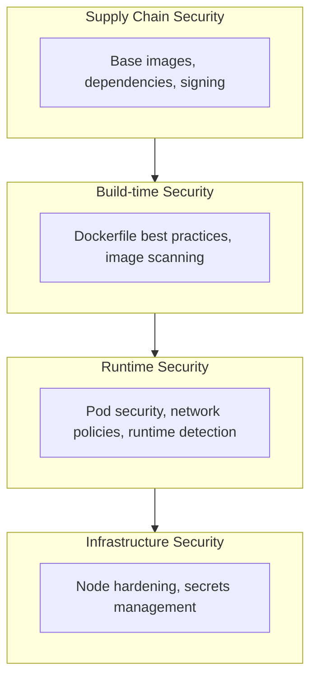

# Container Security Best Practices for Production

Security must be built into every layer of your container infrastructure. This guide covers practical techniques for securing containers from build to runtime.

## Security Layers



## Step 1: Secure Base Images

### Use Minimal Base Images

```dockerfile
# Bad: Full OS with unnecessary packages
FROM ubuntu:22.04

# Good: Minimal distroless image
FROM gcr.io/distroless/static-debian12

# Good: Alpine for when you need a shell
FROM alpine:3.19
```

### Pin Image Versions

```dockerfile
# Bad: Mutable tag
FROM node:latest

# Good: Immutable digest
FROM node:20.10.0-alpine3.19@sha256:abc123...
```

### Multi-stage Builds

```dockerfile
# Build stage
FROM golang:1.22-alpine AS builder
WORKDIR /app
COPY go.mod go.sum ./
RUN go mod download
COPY . .
RUN CGO_ENABLED=0 GOOS=linux go build -a -installsuffix cgo -o main .

# Runtime stage
FROM gcr.io/distroless/static-debian12
COPY --from=builder /app/main /
USER nonroot:nonroot
ENTRYPOINT ["/main"]
```

## Step 2: Image Scanning

### Trivy Scanner

```bash
# Scan local image
trivy image my-app:latest

# Scan with severity filter
trivy image --severity HIGH,CRITICAL my-app:latest

# Scan and fail CI on vulnerabilities
trivy image --exit-code 1 --severity CRITICAL my-app:latest

# Scan filesystem (for dependencies)
trivy fs --scanners vuln,secret,misconfig .
```

### GitHub Actions Integration

```yaml
name: Security Scan
on: [push, pull_request]

jobs:
  scan:
    runs-on: ubuntu-latest
    steps:
      - uses: actions/checkout@v4
      
      - name: Build image
        run: docker build -t my-app:${{ github.sha }} .
      
      - name: Run Trivy vulnerability scanner
        uses: aquasecurity/trivy-action@master
        with:
          image-ref: 'my-app:${{ github.sha }}'
          format: 'sarif'
          output: 'trivy-results.sarif'
          severity: 'CRITICAL,HIGH'
      
      - name: Upload Trivy scan results
        uses: github/codeql-action/upload-sarif@v3
        with:
          sarif_file: 'trivy-results.sarif'
```

## Step 3: Dockerfile Best Practices

```dockerfile
# 1. Use specific base image version
FROM node:20.10.0-alpine3.19

# 2. Create non-root user
RUN addgroup -g 1001 appgroup && \
    adduser -u 1001 -G appgroup -D appuser

# 3. Set working directory
WORKDIR /app

# 4. Copy dependency files first (layer caching)
COPY package*.json ./

# 5. Install dependencies with clean cache
RUN npm ci --only=production && \
    npm cache clean --force

# 6. Copy application code
COPY --chown=appuser:appgroup . .

# 7. Remove unnecessary files
RUN rm -rf tests/ docs/ .git/

# 8. Switch to non-root user
USER appuser

# 9. Use exec form for ENTRYPOINT
ENTRYPOINT ["node", "server.js"]

# 10. Expose specific port
EXPOSE 3000

# 11. Add health check
HEALTHCHECK --interval=30s --timeout=3s --start-period=5s --retries=3 \
  CMD wget --no-verbose --tries=1 --spider http://localhost:3000/health || exit 1
```

## Step 4: Pod Security Standards

### Restricted Pod Security

```yaml
apiVersion: v1
kind: Pod
metadata:
  name: secure-pod
spec:
  securityContext:
    runAsNonRoot: true
    runAsUser: 1001
    runAsGroup: 1001
    fsGroup: 1001
    seccompProfile:
      type: RuntimeDefault
  containers:
    - name: app
      image: my-app:v1.0.0
      securityContext:
        allowPrivilegeEscalation: false
        readOnlyRootFilesystem: true
        capabilities:
          drop:
            - ALL
      resources:
        limits:
          memory: "256Mi"
          cpu: "500m"
        requests:
          memory: "128Mi"
          cpu: "100m"
      volumeMounts:
        - name: tmp
          mountPath: /tmp
        - name: cache
          mountPath: /app/.cache
  volumes:
    - name: tmp
      emptyDir: {}
    - name: cache
      emptyDir: {}
```

### Namespace-level Pod Security

```yaml
apiVersion: v1
kind: Namespace
metadata:
  name: production
  labels:
    pod-security.kubernetes.io/enforce: restricted
    pod-security.kubernetes.io/audit: restricted
    pod-security.kubernetes.io/warn: restricted
```

## Step 5: Network Policies

### Default Deny All

```yaml
apiVersion: networking.k8s.io/v1
kind: NetworkPolicy
metadata:
  name: default-deny-all
  namespace: production
spec:
  podSelector: {}
  policyTypes:
    - Ingress
    - Egress
```

### Allow Specific Traffic

```yaml
apiVersion: networking.k8s.io/v1
kind: NetworkPolicy
metadata:
  name: api-network-policy
  namespace: production
spec:
  podSelector:
    matchLabels:
      app: api
  policyTypes:
    - Ingress
    - Egress
  ingress:
    - from:
        - namespaceSelector:
            matchLabels:
              name: ingress
        - podSelector:
            matchLabels:
              app: frontend
      ports:
        - protocol: TCP
          port: 8080
  egress:
    - to:
        - podSelector:
            matchLabels:
              app: database
      ports:
        - protocol: TCP
          port: 5432
    - to:
        - namespaceSelector: {}
          podSelector:
            matchLabels:
              k8s-app: kube-dns
      ports:
        - protocol: UDP
          port: 53
```

## Step 6: Secrets Management

### External Secrets Operator

```bash
# Install ESO
helm repo add external-secrets https://charts.external-secrets.io
helm install external-secrets external-secrets/external-secrets \
  --namespace external-secrets \
  --create-namespace
```

### AWS Secrets Manager Integration

```yaml
apiVersion: external-secrets.io/v1beta1
kind: SecretStore
metadata:
  name: aws-secrets
  namespace: production
spec:
  provider:
    aws:
      service: SecretsManager
      region: us-east-1
      auth:
        jwt:
          serviceAccountRef:
            name: external-secrets-sa

---
apiVersion: external-secrets.io/v1beta1
kind: ExternalSecret
metadata:
  name: database-credentials
  namespace: production
spec:
  refreshInterval: 1h
  secretStoreRef:
    kind: SecretStore
    name: aws-secrets
  target:
    name: database-credentials
    creationPolicy: Owner
  data:
    - secretKey: username
      remoteRef:
        key: production/database
        property: username
    - secretKey: password
      remoteRef:
        key: production/database
        property: password
```

## Step 7: Runtime Security with Falco

```bash
# Install Falco
helm repo add falcosecurity https://falcosecurity.github.io/charts
helm install falco falcosecurity/falco \
  --namespace falco \
  --create-namespace \
  --set falcosidekick.enabled=true \
  --set falcosidekick.config.slack.webhookurl="https://hooks.slack.com/..."
```

### Custom Falco Rules

```yaml
- rule: Detect Crypto Mining
  desc: Detect crypto mining processes
  condition: >
    spawned_process and 
    (proc.name in (xmrig, minerd, minergate, cpuminer) or
     proc.cmdline contains "stratum+tcp" or
     proc.cmdline contains "pool.minergate.com")
  output: >
    Crypto mining detected (user=%user.name command=%proc.cmdline 
    container=%container.name image=%container.image.repository)
  priority: CRITICAL
  tags: [cryptomining, mitre_execution]

- rule: Detect Shell in Container
  desc: Detect shell spawned in container
  condition: >
    container and 
    spawned_process and 
    shell_procs and 
    not shell_in_container_allowed
  output: >
    Shell spawned in container (user=%user.name shell=%proc.name 
    container=%container.name image=%container.image.repository)
  priority: WARNING
  tags: [shell, mitre_execution]
```

## Step 8: Image Signing with Cosign

```bash
# Generate key pair
cosign generate-key-pair

# Sign image
cosign sign --key cosign.key my-registry/my-app:v1.0.0

# Verify signature
cosign verify --key cosign.pub my-registry/my-app:v1.0.0
```

### Admission Controller with Kyverno

```yaml
apiVersion: kyverno.io/v1
kind: ClusterPolicy
metadata:
  name: verify-image-signature
spec:
  validationFailureAction: Enforce
  background: false
  rules:
    - name: verify-signature
      match:
        any:
          - resources:
              kinds:
                - Pod
      verifyImages:
        - imageReferences:
            - "my-registry/*"
          attestors:
            - entries:
                - keys:
                    publicKeys: |-
                      -----BEGIN PUBLIC KEY-----
                      ...
                      -----END PUBLIC KEY-----
```

## Security Checklist

### Build Time
- [ ] Use minimal base images
- [ ] Pin image versions with digests
- [ ] Multi-stage builds
- [ ] Scan images for vulnerabilities
- [ ] Sign images
- [ ] No secrets in images

### Runtime
- [ ] Run as non-root
- [ ] Read-only root filesystem
- [ ] Drop all capabilities
- [ ] Resource limits set
- [ ] Network policies applied
- [ ] Pod Security Standards enforced
- [ ] Runtime security monitoring

### Infrastructure
- [ ] Secrets externalized
- [ ] RBAC configured
- [ ] Audit logging enabled
- [ ] Node hardening applied
- [ ] Regular security updates

## Summary

You now have:
- Secure container build pipeline
- Image scanning in CI/CD
- Pod security hardening
- Network segmentation
- External secrets management
- Runtime threat detection
- Image signing and verification

Security is an ongoing process—regularly review and update your security posture.