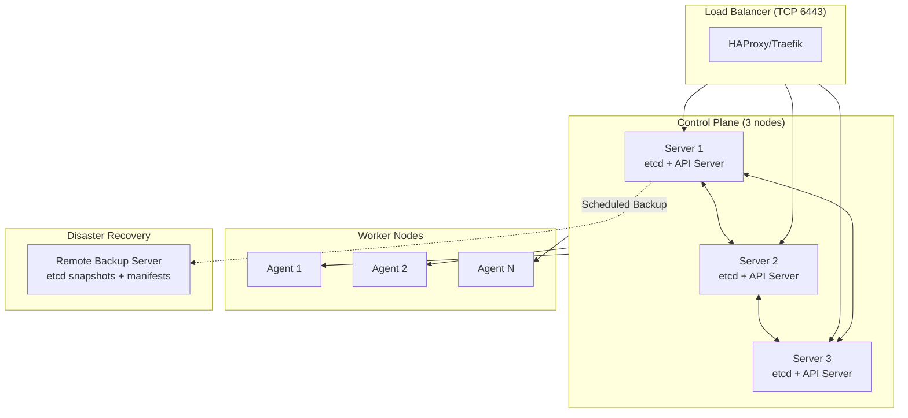
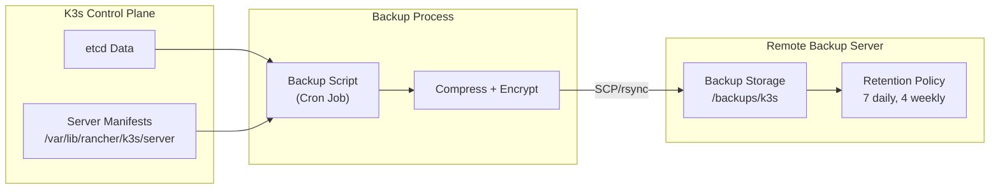

# Production K3s Cluster Setup with etcd, DR Backup, Security & CNI

This comprehensive guide walks you through setting up a production-ready K3s cluster with embedded etcd, implementing disaster recovery backup to remote servers, security hardening, and CNI configuration options.

## Prerequisites

- **Minimum 3 servers** for HA control plane (etcd requires odd number for quorum)
- Ubuntu 22.04 LTS or RHEL 8+ on each node
- Minimum specs per node: 2 vCPU, 4GB RAM, 50GB SSD
- Network connectivity between all nodes
- Root or sudo access
- **Remote backup server** for DR (SSH access required)

## Architecture Overview



## Node Requirements

| Role | Minimum Nodes | Recommended | Purpose |
|------|---------------|-------------|---------|
| Server (Control Plane) | 3 | 3 or 5 | etcd + API server + controller manager |
| Agent (Worker) | 2 | 3+ | Application workloads |
| Load Balancer | 1 | 2 (HA) | API server load balancing |
| Backup Server | 1 | 1 | Remote DR storage |

**Why 3 control plane nodes?** etcd uses Raft consensus and requires a quorum (majority) to function. With 3 nodes, you can tolerate 1 failure. With 5 nodes, you can tolerate 2 failures.

---

## Part 1: Cluster Setup

### Step 1: Prepare All Nodes

Run on **all nodes** (servers and agents):

```bash
# Update system
sudo apt update && sudo apt upgrade -y

# Disable swap (required for Kubernetes)
sudo swapoff -a
sudo sed -i '/ swap / s/^/#/' /etc/fstab

# Load required kernel modules
cat <<EOF | sudo tee /etc/modules-load.d/k3s.conf
br_netfilter
overlay
ip_vs
ip_vs_rr
ip_vs_wrr
ip_vs_sh
nf_conntrack
EOF

sudo modprobe br_netfilter
sudo modprobe overlay

# Configure sysctl for Kubernetes networking
cat <<EOF | sudo tee /etc/sysctl.d/k3s.conf
net.bridge.bridge-nf-call-iptables = 1
net.bridge.bridge-nf-call-ip6tables = 1
net.ipv4.ip_forward = 1
net.ipv4.conf.all.forwarding = 1
net.ipv6.conf.all.forwarding = 1
fs.inotify.max_user_instances = 524288
fs.inotify.max_user_watches = 524288
EOF

sudo sysctl --system

# Install required packages
sudo apt install -y curl wget apt-transport-https ca-certificates
```

### Step 2: Configure Firewall Rules

Run on **all nodes**:

```bash
# Control Plane Ports
sudo ufw allow 6443/tcp   # Kubernetes API server
sudo ufw allow 2379/tcp   # etcd client requests
sudo ufw allow 2380/tcp   # etcd peer communication
sudo ufw allow 10250/tcp  # Kubelet API
sudo ufw allow 10251/tcp  # kube-scheduler
sudo ufw allow 10252/tcp  # kube-controller-manager

# CNI Ports (Flannel default)
sudo ufw allow 8472/udp   # VXLAN overlay
sudo ufw allow 51820/udp  # WireGuard IPv4
sudo ufw allow 51821/udp  # WireGuard IPv6

# Calico CNI (if using Calico)
sudo ufw allow 179/tcp    # BGP
sudo ufw allow 4789/udp   # VXLAN
sudo ufw allow 5473/tcp   # Typha

# Cilium CNI (if using Cilium)
sudo ufw allow 4240/tcp   # Health checks
sudo ufw allow 4244/tcp   # Hubble
sudo ufw allow 8472/udp   # VXLAN

# NodePort range
sudo ufw allow 30000:32767/tcp

sudo ufw enable
```

### Step 3: Set Up Load Balancer

Install HAProxy on your load balancer server:

```bash
sudo apt install -y haproxy

# Backup original config
sudo cp /etc/haproxy/haproxy.cfg /etc/haproxy/haproxy.cfg.bak
```

Configure HAProxy:

```bash
cat <<EOF | sudo tee /etc/haproxy/haproxy.cfg
global
    log /dev/log local0
    log /dev/log local1 notice
    chroot /var/lib/haproxy
    stats socket /run/haproxy/admin.sock mode 660 level admin
    stats timeout 30s
    user haproxy
    group haproxy
    daemon

defaults
    log     global
    mode    tcp
    option  tcplog
    option  dontlognull
    timeout connect 5000ms
    timeout client  50000ms
    timeout server  50000ms

frontend k3s_api
    bind *:6443
    mode tcp
    default_backend k3s_servers

backend k3s_servers
    mode tcp
    balance roundrobin
    option tcp-check
    server server1 10.0.1.10:6443 check fall 3 rise 2
    server server2 10.0.1.11:6443 check fall 3 rise 2
    server server3 10.0.1.12:6443 check fall 3 rise 2

listen stats
    bind *:8404
    mode http
    stats enable
    stats uri /stats
    stats refresh 10s
    stats admin if LOCALHOST
EOF

sudo systemctl restart haproxy
sudo systemctl enable haproxy
```

### Step 4: Initialize First Server Node

On **server1** (first control plane node):

```bash
# Generate a secure token
export K3S_TOKEN=$(openssl rand -hex 32)
echo "K3S_TOKEN=$K3S_TOKEN" | sudo tee /etc/k3s-token
echo "Save this token securely!"

# Set your load balancer IP/FQDN
export LB_IP="10.0.1.100"
export LB_FQDN="k3s.example.com"

# Install K3s with embedded etcd
curl -sfL https://get.k3s.io | sh -s - server \
    --cluster-init \
    --token="$K3S_TOKEN" \
    --tls-san="$LB_IP" \
    --tls-san="$LB_FQDN" \
    --write-kubeconfig-mode=644 \
    --etcd-expose-metrics=true \
    --kube-controller-manager-arg="bind-address=0.0.0.0" \
    --kube-scheduler-arg="bind-address=0.0.0.0" \
    --node-taint CriticalAddonsOnly=true:NoExecute
```

**Flags explained:**
- `--cluster-init`: Initialize with embedded etcd
- `--tls-san`: Add Subject Alternative Names for TLS certificate
- `--etcd-expose-metrics`: Enable etcd metrics for monitoring
- `--node-taint`: Prevent workloads on control plane nodes

Verify the installation:

```bash
# Check K3s status
sudo systemctl status k3s

# Check node status
sudo k3s kubectl get nodes

# Verify etcd cluster health
sudo k3s etcdctl endpoint health --cluster
sudo k3s etcdctl member list
```

### Step 5: Join Additional Server Nodes

On **server2** and **server3**:

```bash
# Use the same token from step 4
export K3S_TOKEN="<TOKEN_FROM_STEP_4>"
export FIRST_SERVER_IP="10.0.1.10"
export LB_IP="10.0.1.100"
export LB_FQDN="k3s.example.com"

curl -sfL https://get.k3s.io | sh -s - server \
    --server="https://$FIRST_SERVER_IP:6443" \
    --token="$K3S_TOKEN" \
    --tls-san="$LB_IP" \
    --tls-san="$LB_FQDN" \
    --write-kubeconfig-mode=644 \
    --etcd-expose-metrics=true \
    --kube-controller-manager-arg="bind-address=0.0.0.0" \
    --kube-scheduler-arg="bind-address=0.0.0.0" \
    --node-taint CriticalAddonsOnly=true:NoExecute
```

Verify all control plane nodes:

```bash
sudo k3s kubectl get nodes
# Expected: 3 nodes with "control-plane,etcd,master" roles

sudo k3s etcdctl member list
# Expected: 3 etcd members
```

### Step 6: Join Worker Nodes

On each **agent** (worker) node:

```bash
export K3S_TOKEN="<TOKEN_FROM_STEP_4>"
export LB_IP="10.0.1.100"

curl -sfL https://get.k3s.io | sh -s - agent \
    --server="https://$LB_IP:6443" \
    --token="$K3S_TOKEN"
```

---

## Part 2: Disaster Recovery Backup Strategy

### Backup Architecture



### Step 7: Set Up Remote Backup Server

On the **backup server**:

```bash
# Create backup user
sudo useradd -m -s /bin/bash k3s-backup

# Create backup directory
sudo mkdir -p /backups/k3s/{daily,weekly,monthly}
sudo chown -R k3s-backup:k3s-backup /backups/k3s

# Set up SSH key authentication (run on control plane server)
# On server1:
sudo ssh-keygen -t ed25519 -f /root/.ssh/k3s_backup_key -N ""
sudo ssh-copy-id -i /root/.ssh/k3s_backup_key.pub k3s-backup@<BACKUP_SERVER_IP>
```

### Step 8: Create Backup Script

On **server1** (primary control plane):

```bash
cat <<'EOF' | sudo tee /usr/local/bin/k3s-backup.sh
#!/bin/bash
set -euo pipefail

# Configuration
BACKUP_SERVER="k3s-backup@10.0.1.200"
BACKUP_DIR="/backups/k3s"
SSH_KEY="/root/.ssh/k3s_backup_key"
RETENTION_DAILY=7
RETENTION_WEEKLY=4
RETENTION_MONTHLY=3
ENCRYPTION_KEY="/root/.backup-encryption-key"

# Generate encryption key if not exists
if [ ! -f "$ENCRYPTION_KEY" ]; then
    openssl rand -base64 32 > "$ENCRYPTION_KEY"
    chmod 600 "$ENCRYPTION_KEY"
    echo "Encryption key generated. Back this up securely!"
fi

TIMESTAMP=$(date +%Y%m%d_%H%M%S)
DAY_OF_WEEK=$(date +%u)
DAY_OF_MONTH=$(date +%d)
LOCAL_BACKUP_DIR="/var/lib/rancher/k3s/server/db/snapshots"
TEMP_DIR=$(mktemp -d)
BACKUP_FILE="k3s-backup-${TIMESTAMP}.tar.gz.enc"

echo "$(date): Starting K3s backup..."

# Create etcd snapshot
echo "Creating etcd snapshot..."
k3s etcd-snapshot save --name "backup-${TIMESTAMP}"

# Wait for snapshot to complete
sleep 5

# Find the latest snapshot
LATEST_SNAPSHOT=$(ls -t ${LOCAL_BACKUP_DIR}/*.db 2>/dev/null | head -1)

if [ -z "$LATEST_SNAPSHOT" ]; then
    echo "ERROR: No etcd snapshot found!"
    exit 1
fi

# Copy important files to temp directory
echo "Collecting backup files..."
mkdir -p "${TEMP_DIR}/etcd"
mkdir -p "${TEMP_DIR}/pki"
mkdir -p "${TEMP_DIR}/manifests"

cp "$LATEST_SNAPSHOT" "${TEMP_DIR}/etcd/"
cp -r /var/lib/rancher/k3s/server/tls "${TEMP_DIR}/pki/" 2>/dev/null || true
cp /var/lib/rancher/k3s/server/token "${TEMP_DIR}/" 2>/dev/null || true
cp -r /var/lib/rancher/k3s/server/manifests "${TEMP_DIR}/manifests/" 2>/dev/null || true

# Include cluster configuration
k3s kubectl get nodes -o yaml > "${TEMP_DIR}/nodes.yaml"
k3s kubectl get all --all-namespaces -o yaml > "${TEMP_DIR}/all-resources.yaml" 2>/dev/null || true

# Create compressed archive
echo "Creating compressed archive..."
tar -czf "${TEMP_DIR}/backup.tar.gz" -C "${TEMP_DIR}" .

# Encrypt the backup
echo "Encrypting backup..."
openssl enc -aes-256-cbc -salt -pbkdf2 \
    -in "${TEMP_DIR}/backup.tar.gz" \
    -out "${TEMP_DIR}/${BACKUP_FILE}" \
    -pass file:"$ENCRYPTION_KEY"

# Determine backup type and destination
if [ "$DAY_OF_MONTH" = "01" ]; then
    DEST_DIR="${BACKUP_DIR}/monthly"
    RETENTION=$RETENTION_MONTHLY
elif [ "$DAY_OF_WEEK" = "7" ]; then
    DEST_DIR="${BACKUP_DIR}/weekly"
    RETENTION=$RETENTION_WEEKLY
else
    DEST_DIR="${BACKUP_DIR}/daily"
    RETENTION=$RETENTION_DAILY
fi

# Transfer to remote server
echo "Transferring to remote server..."
scp -i "$SSH_KEY" -o StrictHostKeyChecking=no \
    "${TEMP_DIR}/${BACKUP_FILE}" \
    "${BACKUP_SERVER}:${DEST_DIR}/"

# Apply retention policy on remote server
echo "Applying retention policy..."
ssh -i "$SSH_KEY" "$BACKUP_SERVER" "cd ${DEST_DIR} && ls -t *.enc 2>/dev/null | tail -n +$((RETENTION + 1)) | xargs -r rm -f"

# Cleanup
rm -rf "${TEMP_DIR}"

# Cleanup old local snapshots (keep last 3)
cd "${LOCAL_BACKUP_DIR}" && ls -t *.db 2>/dev/null | tail -n +4 | xargs -r rm -f

echo "$(date): Backup completed successfully: ${BACKUP_FILE}"

# Verify backup on remote server
ssh -i "$SSH_KEY" "$BACKUP_SERVER" "ls -la ${DEST_DIR}/${BACKUP_FILE}"
EOF

sudo chmod +x /usr/local/bin/k3s-backup.sh
```

### Step 9: Schedule Automated Backups

```bash
# Create cron job for daily backups at 2 AM
cat <<EOF | sudo tee /etc/cron.d/k3s-backup
SHELL=/bin/bash
PATH=/usr/local/sbin:/usr/local/bin:/sbin:/bin:/usr/sbin:/usr/bin

# Daily backup at 2:00 AM
0 2 * * * root /usr/local/bin/k3s-backup.sh >> /var/log/k3s-backup.log 2>&1

# Additional backup before maintenance windows (Sundays at 11 PM)
0 23 * * 0 root /usr/local/bin/k3s-backup.sh >> /var/log/k3s-backup.log 2>&1
EOF

# Create log rotation
cat <<EOF | sudo tee /etc/logrotate.d/k3s-backup
/var/log/k3s-backup.log {
    weekly
    rotate 4
    compress
    delaycompress
    missingok
    notifempty
    create 640 root root
}
EOF

# Test the backup script
sudo /usr/local/bin/k3s-backup.sh
```

### Step 10: Disaster Recovery Procedure

Create a restore script:

```bash
cat <<'EOF' | sudo tee /usr/local/bin/k3s-restore.sh
#!/bin/bash
set -euo pipefail

# Configuration
BACKUP_SERVER="k3s-backup@10.0.1.200"
BACKUP_DIR="/backups/k3s"
SSH_KEY="/root/.ssh/k3s_backup_key"
ENCRYPTION_KEY="/root/.backup-encryption-key"

if [ $# -lt 1 ]; then
    echo "Usage: $0 <backup-file> [daily|weekly|monthly]"
    echo ""
    echo "Available backups:"
    for type in daily weekly monthly; do
        echo "  ${type}:"
        ssh -i "$SSH_KEY" "$BACKUP_SERVER" "ls -la ${BACKUP_DIR}/${type}/*.enc 2>/dev/null" | tail -5
    done
    exit 1
fi

BACKUP_FILE=$1
BACKUP_TYPE=${2:-daily}
TEMP_DIR=$(mktemp -d)

echo "WARNING: This will restore K3s from backup!"
echo "Current cluster data will be replaced."
read -p "Are you sure? (yes/no): " CONFIRM

if [ "$CONFIRM" != "yes" ]; then
    echo "Restore cancelled."
    exit 0
fi

echo "Downloading backup from remote server..."
scp -i "$SSH_KEY" "${BACKUP_SERVER}:${BACKUP_DIR}/${BACKUP_TYPE}/${BACKUP_FILE}" "${TEMP_DIR}/"

echo "Decrypting backup..."
openssl enc -aes-256-cbc -d -pbkdf2 \
    -in "${TEMP_DIR}/${BACKUP_FILE}" \
    -out "${TEMP_DIR}/backup.tar.gz" \
    -pass file:"$ENCRYPTION_KEY"

echo "Extracting backup..."
tar -xzf "${TEMP_DIR}/backup.tar.gz" -C "${TEMP_DIR}"

echo "Stopping K3s service..."
sudo systemctl stop k3s

echo "Restoring etcd snapshot..."
SNAPSHOT_FILE=$(ls "${TEMP_DIR}/etcd/"*.db | head -1)

# Restore with the snapshot
sudo k3s server \
    --cluster-reset \
    --cluster-reset-restore-path="$SNAPSHOT_FILE"

echo "Restoring certificates and manifests..."
sudo cp -r "${TEMP_DIR}/pki/"* /var/lib/rancher/k3s/server/tls/ 2>/dev/null || true
sudo cp -r "${TEMP_DIR}/manifests/"* /var/lib/rancher/k3s/server/manifests/ 2>/dev/null || true

echo "Starting K3s service..."
sudo systemctl start k3s

echo "Waiting for cluster to be ready..."
sleep 30

echo "Verifying cluster status..."
sudo k3s kubectl get nodes
sudo k3s kubectl get pods -A

rm -rf "${TEMP_DIR}"
echo "Restore completed! Please verify cluster health."
EOF

sudo chmod +x /usr/local/bin/k3s-restore.sh
```

---

## Part 3: Security Hardening

### Step 11: Secure etcd Communication

etcd is already secured by K3s with mutual TLS. Verify:

```bash
# Check etcd certificates
sudo ls -la /var/lib/rancher/k3s/server/tls/etcd/

# Verify TLS is enabled
sudo k3s etcdctl endpoint status --cluster \
    --cacert=/var/lib/rancher/k3s/server/tls/etcd/server-ca.crt \
    --cert=/var/lib/rancher/k3s/server/tls/etcd/server-client.crt \
    --key=/var/lib/rancher/k3s/server/tls/etcd/server-client.key
```

### Step 12: Enable Pod Security Standards

```bash
# Create Pod Security configuration
cat <<EOF | sudo tee /var/lib/rancher/k3s/server/manifests/pod-security.yaml
apiVersion: v1
kind: Namespace
metadata:
  name: restricted-ns
  labels:
    pod-security.kubernetes.io/enforce: restricted
    pod-security.kubernetes.io/enforce-version: latest
    pod-security.kubernetes.io/audit: restricted
    pod-security.kubernetes.io/audit-version: latest
    pod-security.kubernetes.io/warn: restricted
    pod-security.kubernetes.io/warn-version: latest
EOF
```

### Step 13: Configure Network Policies

```bash
# Default deny all ingress traffic
cat <<EOF | sudo k3s kubectl apply -f -
apiVersion: networking.k8s.io/v1
kind: NetworkPolicy
metadata:
  name: default-deny-ingress
  namespace: default
spec:
  podSelector: {}
  policyTypes:
  - Ingress
---
apiVersion: networking.k8s.io/v1
kind: NetworkPolicy
metadata:
  name: default-deny-egress
  namespace: default
spec:
  podSelector: {}
  policyTypes:
  - Egress
EOF
```

### Step 14: Enable Audit Logging

```bash
# Create audit policy
cat <<EOF | sudo tee /var/lib/rancher/k3s/server/audit-policy.yaml
apiVersion: audit.k8s.io/v1
kind: Policy
rules:
  # Log all requests at the Metadata level
  - level: Metadata
    resources:
    - group: ""
      resources: ["secrets", "configmaps"]
  
  # Log pod exec/attach at RequestResponse level
  - level: RequestResponse
    resources:
    - group: ""
      resources: ["pods/exec", "pods/attach"]
  
  # Log all other requests at Request level
  - level: Request
    resources:
    - group: ""
    - group: "apps"
    - group: "batch"
EOF

# Restart K3s with audit logging enabled
# Add to /etc/systemd/system/k3s.service.env:
echo 'K3S_ARGS="--kube-apiserver-arg=audit-log-path=/var/log/k3s-audit.log --kube-apiserver-arg=audit-policy-file=/var/lib/rancher/k3s/server/audit-policy.yaml --kube-apiserver-arg=audit-log-maxage=30 --kube-apiserver-arg=audit-log-maxbackup=10 --kube-apiserver-arg=audit-log-maxsize=100"' | sudo tee -a /etc/systemd/system/k3s.service.env

sudo systemctl daemon-reload
sudo systemctl restart k3s
```

### Step 15: Implement RBAC Best Practices

```bash
# Create read-only cluster role
cat <<EOF | sudo k3s kubectl apply -f -
apiVersion: rbac.authorization.k8s.io/v1
kind: ClusterRole
metadata:
  name: cluster-viewer
rules:
- apiGroups: [""]
  resources: ["pods", "services", "configmaps", "nodes"]
  verbs: ["get", "list", "watch"]
- apiGroups: ["apps"]
  resources: ["deployments", "daemonsets", "statefulsets"]
  verbs: ["get", "list", "watch"]
---
apiVersion: rbac.authorization.k8s.io/v1
kind: ClusterRole
metadata:
  name: namespace-admin
rules:
- apiGroups: ["", "apps", "batch", "networking.k8s.io"]
  resources: ["*"]
  verbs: ["*"]
EOF

# Create service account with limited permissions
cat <<EOF | sudo k3s kubectl apply -f -
apiVersion: v1
kind: ServiceAccount
metadata:
  name: developer
  namespace: default
---
apiVersion: rbac.authorization.k8s.io/v1
kind: RoleBinding
metadata:
  name: developer-binding
  namespace: default
subjects:
- kind: ServiceAccount
  name: developer
  namespace: default
roleRef:
  kind: ClusterRole
  name: namespace-admin
  apiGroup: rbac.authorization.k8s.io
EOF
```

### Step 16: Secure Secrets Management

```bash
# Enable secrets encryption at rest
cat <<EOF | sudo tee /var/lib/rancher/k3s/server/secrets-encryption.yaml
apiVersion: apiserver.config.k8s.io/v1
kind: EncryptionConfiguration
resources:
  - resources:
      - secrets
    providers:
      - aescbc:
          keys:
            - name: key1
              secret: $(openssl rand -base64 32)
      - identity: {}
EOF

# Add to K3s configuration
# In /etc/systemd/system/k3s.service.env add:
# --kube-apiserver-arg=encryption-provider-config=/var/lib/rancher/k3s/server/secrets-encryption.yaml
```

---

## Part 4: CNI Options

K3s supports multiple Container Network Interfaces. Here are the options:

### Default: Flannel

Flannel is the default CNI in K3s. It's simple and works well for most use cases.

```bash
# K3s installs Flannel by default
# To specify Flannel backend explicitly:
curl -sfL https://get.k3s.io | sh -s - server \
    --flannel-backend=vxlan  # Options: vxlan, host-gw, wireguard-native
```

**Flannel Backends:**

| Backend | Description | Best For |
|---------|-------------|----------|
| `vxlan` | Default, works across subnets | Most environments |
| `host-gw` | Direct routing, no encapsulation | Same L2 network |
| `wireguard-native` | Encrypted overlay | Security-focused |

### Option 1: Calico CNI

```bash
# Install K3s without Flannel
curl -sfL https://get.k3s.io | sh -s - server \
    --cluster-init \
    --flannel-backend=none \
    --disable-network-policy \
    --token="$K3S_TOKEN"

# Install Calico
kubectl apply -f https://raw.githubusercontent.com/projectcalico/calico/v3.27.0/manifests/calico.yaml

# Configure Calico for K3s
cat <<EOF | kubectl apply -f -
apiVersion: operator.tigera.io/v1
kind: Installation
metadata:
  name: default
spec:
  calicoNetwork:
    ipPools:
    - blockSize: 26
      cidr: 10.42.0.0/16
      encapsulation: VXLANCrossSubnet
      natOutgoing: Enabled
      nodeSelector: all()
EOF
```

**Calico Features:**
- Network policies (L3-L4)
- BGP peering
- eBPF dataplane option
- Advanced security features

### Option 2: Cilium CNI

```bash
# Install K3s without Flannel
curl -sfL https://get.k3s.io | sh -s - server \
    --cluster-init \
    --flannel-backend=none \
    --disable-network-policy \
    --token="$K3S_TOKEN"

# Install Cilium CLI
CILIUM_CLI_VERSION=$(curl -s https://raw.githubusercontent.com/cilium/cilium-cli/main/stable.txt)
curl -L --remote-name-all https://github.com/cilium/cilium-cli/releases/download/${CILIUM_CLI_VERSION}/cilium-linux-amd64.tar.gz
sudo tar xzvfC cilium-linux-amd64.tar.gz /usr/local/bin

# Install Cilium
cilium install --version 1.15.0

# Verify installation
cilium status --wait
```

**Cilium Features:**
- eBPF-based networking
- L7 network policies
- Hubble observability
- Service mesh capabilities
- Transparent encryption

### Option 3: Multus (Multiple CNIs)

```bash
# Install Multus for multiple CNI support
kubectl apply -f https://raw.githubusercontent.com/k8snetworkplumbingwg/multus-cni/master/deployments/multus-daemonset.yml

# Create additional network attachment
cat <<EOF | kubectl apply -f -
apiVersion: k8s.cni.cncf.io/v1
kind: NetworkAttachmentDefinition
metadata:
  name: macvlan-conf
spec:
  config: '{
    "cniVersion": "0.3.1",
    "type": "macvlan",
    "master": "eth0",
    "mode": "bridge",
    "ipam": {
      "type": "host-local",
      "subnet": "192.168.1.0/24",
      "rangeStart": "192.168.1.200",
      "rangeEnd": "192.168.1.250"
    }
  }'
EOF
```

### CNI Comparison Table

| Feature | Flannel | Calico | Cilium |
|---------|---------|--------|--------|
| Complexity | Low | Medium | High |
| Network Policies | Basic | Advanced (L3-L4) | Advanced (L3-L7) |
| Encryption | WireGuard | WireGuard/IPsec | WireGuard/IPsec |
| Performance | Good | Very Good | Excellent (eBPF) |
| Observability | Basic | Good | Excellent (Hubble) |
| Resource Usage | Low | Medium | Medium-High |
| Best For | Simple clusters | Enterprise | Advanced features |

---

## Part 5: Monitoring and Verification

### Step 17: Verify Cluster Health

```bash
# Check all components
sudo k3s kubectl get nodes -o wide
sudo k3s kubectl get pods -A
sudo k3s kubectl get componentstatuses

# Check etcd health
sudo k3s etcdctl endpoint health --cluster

# Check etcd member list
sudo k3s etcdctl member list -w table

# Check certificates expiration
sudo k3s kubectl get nodes -o jsonpath='{.items[*].status.conditions[?(@.type=="Ready")].message}'

# Run conformance tests
sudo k3s kubectl run test --image=busybox --rm -it --restart=Never -- wget -qO- http://kubernetes.default.svc/healthz
```

### Step 18: Set Up Monitoring (Optional)

```bash
# Install kube-prometheus-stack for monitoring
helm repo add prometheus-community https://prometheus-community.github.io/helm-charts
helm repo update

helm install monitoring prometheus-community/kube-prometheus-stack \
    --namespace monitoring \
    --create-namespace \
    --set prometheus.prometheusSpec.retention=7d \
    --set grafana.adminPassword=admin
```

---

## Summary

You now have:

1. **3-node HA K3s cluster** with embedded etcd
2. **Load balancer** for API server high availability
3. **Automated DR backup** to remote server with encryption
4. **Security hardening** including:
   - Pod Security Standards
   - Network Policies
   - Audit Logging
   - RBAC best practices
   - Secrets encryption at rest
5. **CNI options** configured (Flannel, Calico, or Cilium)

### Quick Reference Commands

```bash
# Cluster status
sudo k3s kubectl get nodes
sudo k3s etcdctl member list

# Manual backup
sudo /usr/local/bin/k3s-backup.sh

# Restore from backup
sudo /usr/local/bin/k3s-restore.sh <backup-file> daily

# Check backup logs
tail -f /var/log/k3s-backup.log

# etcd health
sudo k3s etcdctl endpoint health --cluster
```

### Next Steps

- Set up [ArgoCD for GitOps deployments](/posts/argocd-k3s-setup-sso-rbac)
- Configure [Prometheus and Grafana for monitoring](/posts/prometheus-grafana-kubernetes-monitoring)
- Review [container security best practices](/posts/container-security-best-practices)
