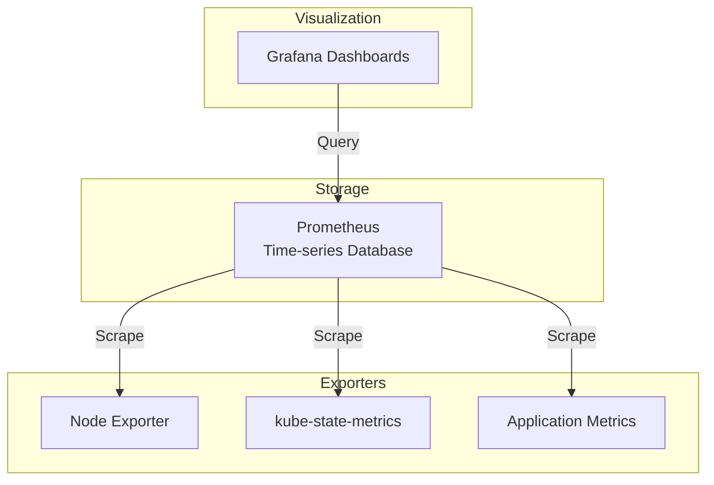

# Kubernetes Monitoring with Prometheus and Grafana

Observability is critical for production Kubernetes clusters. This guide walks through deploying the kube-prometheus-stack for comprehensive monitoring.

## Architecture Overview



## Prerequisites

- Kubernetes cluster with 4GB+ available memory
- Helm 3.x installed
- `kubectl` configured

## Step 1: Install kube-prometheus-stack

```bash
# Add Prometheus community Helm repo
helm repo add prometheus-community https://prometheus-community.github.io/helm-charts
helm repo update

# Create namespace
kubectl create namespace monitoring

# Install with custom values
helm install kube-prometheus prometheus-community/kube-prometheus-stack \
  --namespace monitoring \
  --values values.yaml
```

### Custom Values (values.yaml)

```yaml
prometheus:
  prometheusSpec:
    retention: 30d
    retentionSize: 50GB
    storageSpec:
      volumeClaimTemplate:
        spec:
          storageClassName: local-path
          accessModes: ["ReadWriteOnce"]
          resources:
            requests:
              storage: 50Gi
    resources:
      requests:
        memory: 2Gi
        cpu: 500m
      limits:
        memory: 4Gi
        cpu: 2000m

grafana:
  adminPassword: "change-me-in-production"
  persistence:
    enabled: true
    size: 10Gi
  ingress:
    enabled: true
    ingressClassName: traefik
    hosts:
      - grafana.example.com
    tls:
      - secretName: grafana-tls
        hosts:
          - grafana.example.com

alertmanager:
  alertmanagerSpec:
    storage:
      volumeClaimTemplate:
        spec:
          storageClassName: local-path
          accessModes: ["ReadWriteOnce"]
          resources:
            requests:
              storage: 10Gi
```

## Step 2: Verify Installation

```bash
# Check all pods are running
kubectl get pods -n monitoring

# Expected output:
# NAME                                                     READY   STATUS
# alertmanager-kube-prometheus-alertmanager-0              2/2     Running
# kube-prometheus-grafana-xxx                              3/3     Running
# kube-prometheus-kube-state-metrics-xxx                   1/1     Running
# kube-prometheus-operator-xxx                             1/1     Running
# kube-prometheus-prometheus-node-exporter-xxx             1/1     Running
# prometheus-kube-prometheus-prometheus-0                  2/2     Running
```

## Step 3: Access Grafana

```bash
# Port forward (development)
kubectl port-forward svc/kube-prometheus-grafana 3000:80 -n monitoring

# Get admin password
kubectl get secret kube-prometheus-grafana -n monitoring -o jsonpath="{.data.admin-password}" | base64 -d

# Access at http://localhost:3000
# Username: admin
```

## Step 4: Essential Dashboards

Import these community dashboards in Grafana:

| Dashboard | ID | Description |
|-----------|-----|-------------|
| Kubernetes Cluster | 7249 | Cluster-wide overview |
| Node Exporter Full | 1860 | Detailed node metrics |
| Kubernetes Pods | 6417 | Pod-level metrics |
| CoreDNS | 14981 | DNS performance |

## Step 5: Configure Alerting Rules

```yaml
apiVersion: monitoring.coreos.com/v1
kind: PrometheusRule
metadata:
  name: custom-alerts
  namespace: monitoring
  labels:
    release: kube-prometheus
spec:
  groups:
    - name: kubernetes
      rules:
        - alert: PodCrashLooping
          expr: rate(kube_pod_container_status_restarts_total[15m]) > 0
          for: 5m
          labels:
            severity: warning
          annotations:
            summary: "Pod {{ $labels.pod }} is crash looping"
            
        - alert: HighMemoryUsage
          expr: |
            (container_memory_usage_bytes / container_spec_memory_limit_bytes) > 0.9
          for: 5m
          labels:
            severity: warning
          annotations:
            summary: "Container {{ $labels.container }} memory usage > 90%"
            
        - alert: NodeNotReady
          expr: kube_node_status_condition{condition="Ready",status="true"} == 0
          for: 5m
          labels:
            severity: critical
          annotations:
            summary: "Node {{ $labels.node }} is not ready"
            
        - alert: PersistentVolumeFillingUp
          expr: |
            kubelet_volume_stats_available_bytes / kubelet_volume_stats_capacity_bytes < 0.1
          for: 5m
          labels:
            severity: critical
          annotations:
            summary: "PV {{ $labels.persistentvolumeclaim }} is almost full"
```

## Step 6: Configure AlertManager

```yaml
apiVersion: v1
kind: Secret
metadata:
  name: alertmanager-kube-prometheus-alertmanager
  namespace: monitoring
type: Opaque
stringData:
  alertmanager.yaml: |
    global:
      resolve_timeout: 5m
      slack_api_url: 'https://hooks.slack.com/services/xxx'
    
    route:
      group_by: ['alertname', 'namespace']
      group_wait: 30s
      group_interval: 5m
      repeat_interval: 4h
      receiver: 'slack-notifications'
      routes:
        - match:
            severity: critical
          receiver: 'pagerduty'
        - match:
            severity: warning
          receiver: 'slack-notifications'
    
    receivers:
      - name: 'slack-notifications'
        slack_configs:
          - channel: '#alerts'
            send_resolved: true
            title: '{{ .Status | toUpper }}: {{ .CommonLabels.alertname }}'
            text: '{{ range .Alerts }}{{ .Annotations.summary }}{{ end }}'
      
      - name: 'pagerduty'
        pagerduty_configs:
          - service_key: '<your-pagerduty-key>'
            send_resolved: true
```

## Step 7: Application Metrics

### Add ServiceMonitor for Your App

```yaml
apiVersion: monitoring.coreos.com/v1
kind: ServiceMonitor
metadata:
  name: my-app
  namespace: monitoring
  labels:
    release: kube-prometheus
spec:
  namespaceSelector:
    matchNames:
      - default
  selector:
    matchLabels:
      app: my-app
  endpoints:
    - port: metrics
      interval: 30s
      path: /metrics
```

### Example Application with Metrics

```python
# Python Flask with prometheus_client
from flask import Flask
from prometheus_client import Counter, Histogram, generate_latest

app = Flask(__name__)

REQUEST_COUNT = Counter('http_requests_total', 'Total HTTP Requests', ['method', 'endpoint'])
REQUEST_LATENCY = Histogram('http_request_duration_seconds', 'HTTP Request Latency', ['method', 'endpoint'])

@app.route('/metrics')
def metrics():
    return generate_latest()

@app.route('/')
def hello():
    REQUEST_COUNT.labels(method='GET', endpoint='/').inc()
    return 'Hello World'
```

## Step 8: Log Aggregation with Loki (Optional)

```bash
# Add Grafana Helm repo
helm repo add grafana https://grafana.github.io/helm-charts

# Install Loki
helm install loki grafana/loki-stack \
  --namespace monitoring \
  --set promtail.enabled=true \
  --set loki.persistence.enabled=true \
  --set loki.persistence.size=50Gi
```

Add Loki data source in Grafana:
- URL: `http://loki:3100`

## Useful PromQL Queries

```promql
# CPU usage by namespace
sum(rate(container_cpu_usage_seconds_total{container!=""}[5m])) by (namespace)

# Memory usage by pod
sum(container_memory_usage_bytes{container!=""}) by (pod)

# Network I/O
sum(rate(container_network_receive_bytes_total[5m])) by (pod)

# Request rate (application)
sum(rate(http_requests_total[5m])) by (endpoint)

# Error rate
sum(rate(http_requests_total{status=~"5.."}[5m])) / sum(rate(http_requests_total[5m]))

# P99 latency
histogram_quantile(0.99, sum(rate(http_request_duration_seconds_bucket[5m])) by (le))
```

## Summary

You now have:
- Prometheus for metrics collection
- Grafana for visualization
- AlertManager for notifications
- Node and application-level monitoring
- Custom alerting rules
- Optional log aggregation with Loki

**Next steps:** Implement distributed tracing with Jaeger or Tempo.